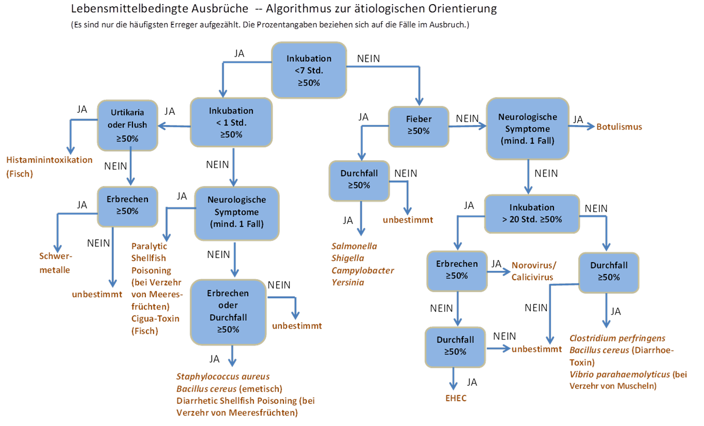

 

 
  
 
      &#9658; Inhaltsverzeichnis Kapitel (ausklappbar) 
  

 
1. TOC
{:toc}
 

 
   

 
 
# Lebensmittelbedingte Ausbrüche

## Ausbruchsteam

Eine
weitreichende Zusammenarbeit zwischen den betroffenen Gesundheitsämtern,
den Veterinär- und
Lebensmittelüberwachungsämtern,
gegebenenfalls übergeordneten Behörden und den jeweils betroffenen
Personen oder
Einrichtungen
ist
wichtig.
Da häufig sehr viele Personen und Einrichtungen betroffen
sind,
kann
es in der Zusammenarbeit zu
Schwierigkeiten
kommen.
Es empfiehlt sich in der Vorbereitungsphase einen guten Kontakt
aufzubauen
an
den Edito: bitte internen
Link
einfugen:
zum
Kapitel Kommunikation im
AUS004Ausbruchsmanagement-Teil).
Wichtig für die
Ausbruchsuntersuchung
ist ein zeitnaher Austausch von vorliegenden Informationen, vor allem
auch über die Sektorengrenzen hinweg, d.h. zwischen den Gesundheits- und
Lebensmittelüberwachungsbehörden.

Bei
lebensmittelbedingten Ausbrüchen ist auch vom Gesetzgeber eine
Zusammenarbeit zwischen Gesundheitsamt und der
Lebensmittelüberwachungsbehörde erwünscht. Im Nachgang zu dem großen
EHEC-Ausbruch in Deutschland im Jahr 2011 wurde
in
§27
IfSG
die
Unterrichtungspflicht des Gesundheitsamtes gegenüber der LMÜ bei einem
lebensmittelbedingten Krankheitsausbruch oder dem Verdacht auf einen
lebensmittelbedingten Krankheitsausbruch festgeschrieben. Parallel dazu
wurde
im §42 Absatz 3 des Lebensmittel- und Futtermitttelgesetzbuches die
Unterrichtungspflicht der LMÜ gegenüber dem Gesundheitsamt
festgeschrieben. 

Für die Lebensmittelüberwachungsbehörden
wird
der
[Leitfaden zur Aufklärung lebensmittelbedingter Ausbrüche entlang der
Lebensmittelkette](https://www.bfr.bund.de/cm/343/ausbruchsaufklaerung-entlang-der-lebensmittelkette.pdf "Leitfadens zur Ausbruchsaufklärung entlang der Lebensmittelkette")
über die
Internetseite
des Bundesinstituts für Risikobewertung (BfR)
zur
Verfügung gestellt. (Bundesinstitut für
Risikobewertung, 2016)

<table>
<colgroup>
<col style="width: 50%" />
<col style="width: 50%" />
</colgroup>
<tbody>
<tr class="odd">
<td>
Aufgabe
</td>
<td>
Inhalt der Aufgabe
</td>
</tr>
<tr class="even">
<td>
Annahme und Verarbeitung der Meldung
</td>
<td>
-Ermittlung: Zeit, Ort, Person, Kontakte, Infektionsquelle/Exposition, Krankenhausaufenthalt, Symptomatik, Reiseanamnese, Berufliche Tätigkeit (§33, 42)

-Dokumentation Ansprechpartner
</td>
</tr>
<tr class="odd">
<td>
Probennahme
</td>
<td>
-Stuhl/Urin/Rachen

-Lebensmittel, auf amtliche, gerichtsfeste Entnahme achten

-Haustiere
</td>
</tr>
<tr class="even">
<td>
Bildung Ausbruchsteam
</td>
<td>
-Zusammenstellung notwendiger Personen 
</td>
</tr>
<tr class="odd">
<td>
Probenverarbeitung
</td>
<td>
-Kontaktierung der entsprechenden Labors

-Durchführung der Testungen 

-Dokumentation der Ergebnisse
</td>
</tr>
<tr class="even">
<td>
Ressourcenbereitstellung
</td>
<td></td>
</tr>
<tr class="odd">
<td>
Meldung an übergeordnete Stellen
</td>
<td>
-Information der lokalen Leitung

-Information der übergeordneten Ämter/Institute
</td>
</tr>
<tr class="even">
<td>
Belehrung Betroffener
</td>
<td>
-Aufklärung: Hygiene, Desinfektionsmaßnahmen, Übertragungswege, Prophylaxe, Weitere Maßnahmen

-Aussprechen von Berufsverboten
</td>
</tr>
<tr class="odd">
<td>
Ausübung von Absonderungsmaßnahmen
</td>
<td></td>
</tr>
<tr class="even">
<td>
Information der Öffentlichkeit
</td>
<td>
- regelmäßige Zusammenfassung der Informationen nach Zeit, Ort, Person

- Informationsweiterleitung an Pressestelle
</td>
</tr>
</tbody>
</table>

Tabelle:
Rollen und Aufgaben des Teams während eines gastroenterischen
Ausbruchs

## Lebensmittelbedingten Ausbruch bestätigen

Ein
lebensmittelbedingter
Ausbruch
wird
vermutet,
wenn
bestimmte Erreger auftreten,
wenn
eine große Anzahl an Personen
anhand
der zu erwartenden
Inkubationszeit
erkranken
oder
wenn
Personen gemeinsam an einer oder mehreren Mahlzeiten teilgenommen haben.

Häufungen
von
Erkrankungen mit
bestimmten
Erregern
deuten immer auf einen
lebensmitelassoziierten
Ausbruch hin, z.B.
Campylobacter,
Salmonellen.
Bei anderen Erregern ist auch eine Übertragung von Person zu Person
möglich,
z.B.
Norovirus.

## Diagnose sichern 

Eine
Bestätigung
eines
lebensmittelassoziierten Ausbruchs ist über eine mikrobiologische
Stuhluntersuchung möglich. In der Praxis besteht häufig die
Schwierigkeit, dass
Ärzte/innen
bei einer einfachen Durchfallerkrankung keine mikrobiologische
Stuhluntersuchung veranlassen oder nur auf wenige Erreger durchführen.
Eine Stuhluntersuchung durch das Gesundheitsamt in Zusammenarbeit mit
einem Labor kann also sinnvoll sein. Eine Übersicht zur
mikrobiologischen Stuhluntersuchung
wird
auf der Webseite des Labormediziners Dr.
Hagemann
im sogenannten Laborlexikon
([http://www.laborlexikon.de/Lexikon/Infoframe/s/Stuhl-Untersuchung\_enteropathogene\_Erreger.htm](http://www.laborlexikon.de/Lexikon/Infoframe/s/Stuhl-Untersuchung_enteropathogene_Erreger.htm "Laborlexikon Stuhl Untersuchungen"))
kostenfrei zur Verfügung
gestellt.

## Falldefinition

Bei
einem lebensmittelassoziierten Ausbruch ist es häufig
sinnvoll,
zunächst
alle
Personen mit gastrointestinalen Symptomen zu betrachten.
Bei
Ausbrüchen durch
gastrointestinale
Erreger
kann der Anteil von Personen, die asymptomatisch bleiben oder nur
geringfügige Symptome haben, hoch sein.

## Hypothese entwickeln und testen

Bei
einem lebensmittelbasierten Ausbruch ist eine Hypothesenüberprüfung
durch
die
Befragung
der
Patienten
und Patientinnen sowie einer geeigneten Vergleichsgruppe
ein
sinnvolles
Mittel,
um
das möglicherweise in Frage kommende Lebensmittel zu eruieren. Eine
analytische
epidemiologische
Untersuchung wird bei lebensmittelassoziierten Ausbrüchen
von
Nicht-Epidemiologen
häufig
nur als "weicher" Hinweis auf das Lebensmittel gewertet.
Abhängig
von
den
Ergebnissen
der
analytischen
epidemiologischen
Untersuchung,
die
typischerweise
als
relatives
Risiko
oder
Chancenverhältnis
(Odds
Ratio)
angegeben
werden,
kann eine analytische Studie stärkere Evidenz liefern als ein
Erregernachweis in einem
Lebensmittel(“Oropharyngeal Tularemia from
Freshly Pressed Grape Must,”
n.d.)
(“Epidemiologisches Bulletin 2007/48,”
2007).

Eine
Labordiagnostik durch
die
zuständige
Lebensmittelüberwachungsbehörde
wird
häufig als eindeutiger Beweis angesehen. Dabei muss beachtet werden,
dass
infizierte
Personen möglicherweise ein Lebensmittel kontaminiert
haben
könnten.
Für eine strenge Beweisführung gelten daher nur Lebensmittel bei denen
eine Kontamination durch die erkrankte Person ausgeschlossen sind,
beispielsweise ungeöffnete Lebensmittel derselben Charge oder Proben aus
dem Betrieb. Gerichtlich anerkannt wird
hierbei
meist
nur eine Probenahme durch eine dafür qualifizierte
Person
(amtliche
Probe).

Evidenz
für den Zusammenhang zwischen Erkrankungen mit einem Lebensmittel kann
auch über Lebensmittelrückverfolgungen oder investigative
Warenstromanalysen erlangt werden. Ausgehend von Erkrankungsclustern,
z.B. in Privathaushalten, Gaststätten oder Krankenhäusern, können die
Lieferwege von Lebensmitteln im Idealfall bis zum Erzeuger
zurückverfolgt werden. Diese Untersuchungen können von den
Lebensmittelüberwachungsbehörden durchgeführt werden.

## Maßnahmen bei einem lebensmittelbedingten  Ausbruch

Die
wichtigste Maßnahme besteht darin, dass das betroffene Lebensmittel
nicht
mehr
verzehrt
und
aus dem Verkehr gezogen
wird,
sofern es noch im Umlauf
ist.

Dies
erfolgt
meist
durch
den
freiwilligen
Rückruf des betroffenen
Lebensmittels
durch
den
Unternehmer.
Kommt
er dieser Verpflichtung nicht nach oder nicht ausreichend nach, erfolgt
dies durch die Lebensmittelüberwachungsbehörde.
Ein
Überblick über aktuelle öffentliche
Lebensmittelwarnungen
ist auf der Webseite
([http://www.lebensmittelwarnung.de](http://www.lebensmittelwarnung.de "http://www.lebensmittelwarnung.de"))
des Bundesamt für Verbraucherschutz und Lebensmisttelsicherheit
ersichtlich.

Über
Lebensmittel mit einem ernsten unmittelbaren oder mittelbaren Risiko für
die menschliche
Gesundheit,
die
international
vertrieben
wurden,
erstellen
die beteiligte(n) LMÜ eine
Meldung
im europäischen Schnellwarnsystem für Lebensmittel und Futtermittel
(Rapid Alert System for Food and
Feed).
(Siehe
[https://www.bvl.bund.de/DE/Arbeitsbereiche/01\_Lebensmittel/01\_Aufgaben/04\_Schnellwarnsystem/lm\_schnellwarnsysteme\_node.html](https://www.bvl.bund.de/DE/Arbeitsbereiche/01_Lebensmittel/01_Aufgaben/04_Schnellwarnsystem/lm_schnellwarnsysteme_node.html "https://www.bvl.bund.de/DE/Arbeitsbereiche/01_Lebensmittel/01_Aufgaben/04_Schnellwarnsystem/lm_schnellwarnsysteme_node.html"))

Viele
Erreger die einen lebensmittelassoziierten Ausbruch hervorrufen können
auch
von Person zu Person weitergeben werden. Eine Information der
betroffenen Personen z.B. mit einem Merkblatt sind also häufig
sinnvoll.

Informationsmaterial
zum sicheren Umgang mit Lebensmitteln sind
auf
der Lebensmittelseite des Bundesinstituts für
Risikobewertung
(BfR)
([https://www.bfr.bund.de/de/lebensmittelhygiene-54338.html](https://www.bfr.bund.de/de/lebensmittelhygiene-54338.html "https://www.bfr.bund.de/de/lebensmittelhygiene-54338.html"))
und
des Bundesamtes für Verbraucherschutz- und Lebensmittelsicherheit
(BVL)
([https://www.bvl.bund.de/DE/Arbeitsbereiche/01\_Lebensmittel/03\_Verbraucher/03\_UmgangLM/lm\_UmgangLM\_node.html](https://www.bvl.bund.de/DE/Arbeitsbereiche/01_Lebensmittel/03_Verbraucher/03_UmgangLM/lm_UmgangLM_node.html%20 "https://www.bvl.bund.de/DE/Arbeitsbereiche/01_Lebensmittel/03_Verbraucher/03_UmgangLM/lm_UmgangLM_node.html "))
verfügbar.

Tätigkeitsverbote
für Lebensmittelpersonal nach § 42
IfSG
und
für Beschäftige in Gemeinschaftseinrichtungen nach § 33
IfSG
sind
ein
Mittel,
um eine Weiterverbreitung der Erkrankung verhindern. Tätigkeitsverbote
nach § 31
IfSG
können
für Personen, die in einer medizinischen Einrichtung oder eine
Massenunterkunft
tätig
sind,
erwogen
werden. In vielen Bundesländern existieren interne Richtlinien für die
Wiederzulassung nach § 42
IfSG,
sowie für die Wiederzulassung
zu
Gemeinschaftseinrichtungen nach §
34
IfSG.
Das
RKI hat
Empfehlungen
zur
Wiederzulassung
in Gemeinschaftseinrichtungen
erstellt
([https://www.rki.de/DE/Content/Infekt/EpidBull/Merkblaetter/Wiederzulassung/Mbl\_Wiederzulassung\_schule.html](https://www.rki.de/DE/Content/Infekt/EpidBull/Merkblaetter/Wiederzulassung/Mbl_Wiederzulassung_schule.html "https://www.rki.de/DE/Content/Infekt/EpidBull/Merkblaetter/Wiederzulassung/Mbl_Wiederzulassung_schule.html"))

### Inkubationszeiten ausgewählter gastroenterischer Erreger

**Erreger**

**Median der Inkubationszeit in Stunden (Tage)**

**Medianspanne von 95% der
untersuchten
Ausbrüche**

Norovirus

32h (1,3 Tage)

12-47h (0,5 – 2 Tage)

Salmonellen (S. enterica)

32h (1,3 Tage)

7-132h (0,3 – 5,5 Tage)

EHEC

87h (3,6 Tage)

37-144h (1,5 – 6 Tage)

Shigellen

45h (1,9 Tage)

11-72h (0,5 – 3 Tage)

Campylobacter

62h (2,5 Tage)

12-168h (0,5 – 7 Tage)

Hepatitis A

672h (28 Tage)

348 – 1008h (14 – 42 Tage)

Quelle:
(“Incubation
periods of enteric illnesses in foodborne outbreaks, United States,
1998–2013,”
2019)

### Empfehlungen zum Managment bei lebensmittelassoziierten Ausbrüchen

<https://www.cdc.gov/ncezid/dfwed/food-safety-office/cifor.html>

<https://www.cdc.gov/foodsafety/outbreaks/investigating-outbreaks/index.html>

<https://www.ecdc.europa.eu/en/publications-data/toolkit-investigation-and-response-food-and-waterborne-disease-outbreaks-eu>

**<https://www.rki.de/DE/Content/Infekt/Ausbrueche/Ausbruchsuntersuchungen/Ausbruchsuntersuchungen_node.html>**

**<https://www.rki.de/DE/Content/Infekt/Ausbrueche/LM/lebensmittelbedingte_Ausbrueche_node.html>**

**<https://www.rki.de/DE/Content/InfAZ/L/Lebensmittel/Linelist-Tool/Linelist_Werkzeuge_Tab_gesamt.html>**

[https://www.untersuchungsaemter-bw.de/pdf/Leitfaden-Management-lebensmittelassoziierter-InfektionenBW.pdf](https://www.untersuchungsaemter-bw.de/pdf/Leitfaden-Management-lebensmittelassoziierter-InfektionenBW.pdf "https://www.untersuchungsaemter-bw.de/pdf/Leitfaden-Management-lebensmittelassoziierter-InfektionenBW.pdf")  

# Nosokomiale Ausbrüche

Von einem meldepflichtigen nosokomialen Ausbruchsgeschehen im Sinne des
IfSG spricht man, beim Auftreten von zwei oder mehr nosokomialen
Infektionen, bei denen ein epidemischer Zusammenhang wahrscheinlich ist
oder vermutet wird. Darüberhinaus können Erregernachweise und / oder
Häufungen ein Hinweis auf zu untersuchende Cluster oder Ausbrüche sein.
Eine kontinuierliech Surveillance sollte im Krankenhaus nach §23 IfSG
für "*nosokomialen Infektionen und das Auftreten von Krankheitserregern
mit speziellen Resistenzen und Multiresistenzen..."*
stattfinden*.
*Nach
§7 Abs. 2 können Häufungen von Erregernaschweise (Kolonisationen)
ebenfalls Meldepflichtige Ereignisse darstellen, sofern eine Gefahr für
die Allgemeinheit abgeleitet werden kann (wie beispielsweise bei
Nachweisen von Erregern mit speziellen Resistenzen). 

Unter Patienten, die in Krankenhäusern behandelt werden, können sich
Infektionskrankheiten und Erreger aus verschiedenen Gründen besonders
leicht ausbreiten. Zum einen sind kranke und dadurch für nosokomiale
Infektionen empfängliche Patienten auf engem Raum zusammen, zum anderen
sind durch zum Teil invasive diagnostische und therapeutische Verfahren
besondere Übertragungswege gegeben. Da viele Krankenhauspatienten
auch
antibiotisch behandelt werden, stellt
die
Entwicklung von
Antibiotika-Resistenzen
(z.B. bei Staphylokokken, Enterokokkenoder gramnegativen
Bakterien) ein besonderes Problem dar. Ältere, abwehrgeschwächte
Patienten, aber auch Frühgeborene sind besonders gefährdet, eine
nosokomiale Infektion zu
erwerben.
(Alpers et al.
[https://edoc.rki.de/bitstream/handle/176904/948/27SMqNuDowQOs.pdf?sequence=1\&isAllowed=y](https://edoc.rki.de/bitstream/handle/176904/948/27SMqNuDowQOs.pdf?sequence=1&isAllowed=y "https://edoc.rki.de/bitstream/handle/176904/948/27SMqNuDowQOs.pdf?sequence=1&isAllowed=y")

)

## Nosokomiale Infektionen

Nosokomiale Infektionen gehen mit einer
relativ
hohen Letalität einher und verlängern die
Krankenhausverweildauer.
Die
Krankheitslast durch nosokomiale Infektionen für die deutsche
Bevölkerung übersteigt die Krankheitslast durch andere
Infektionskrankheiten bei weitem
(Zacher
et al. Eurosurveillance
[https://www.eurosurveillance.org/content/10.2807/1560-7917.ES.2019.24.46.1900135](https://www.eurosurveillance.org/content/10.2807/1560-7917.ES.2019.24.46.1900135 "https://www.eurosurveillance.org/content/10.2807/1560-7917.ES.2019.24.46.1900135")
)

Krankenhausinfektionen,
bzw. Infektionen, die in einem Krankenhaus (oder einer anderen
medizinischen Einrichtung) von Patienten oder Mitarbeitern erworben
wurden
werden als nosokomiale Infektionen bezeichnet.
Auch
Manifestation nach der
Entlassung
aus einem Krankenhaus werden dazu gezählt. Der Begriff umfasst
→exogene und →endogene Infektionen (s.a. →Infektionen, Arten und
Formen). Ausgeschlossen sind Infektionen, die schon vor der
Aufnahme/Behandlung erworben wurden und sich erst in der Einrichtung
manifestiert
haben.

Das
IfSG
definiert nosokomialen Infektion
in
§2
IfSG
im Sinne einer behandlungsassoziierten
Infektion
als "Eine Infektion mit lokalen oder systemischen
Infektionszeichen als Reaktion auf das Vorhandensein von Erregern oder
ihrer Toxine, die im zeitlichen Zusammenhang mit einer stationären oder
einer ambulanten medizinischen Maßnahme steht, soweit die Infektion
nicht bereits vorher
bestand."
Als Infektionserreger (»Krankheitserreger« i.S. des IfSG) gelten
im Falle der nosokomialen Infektionen alle Infektionserreger, auch die
fakultativ pathogenen bzw.
→Opportunisten.
Nach §23 Abs.4 IfSG bestehen Aufzeichnungspflichten für bestimmte
nosokomiale Infektionen und festgestellte Erregerresistenzen. Ein
gehäuftes Auftreten nosokomialer Infektionen ist dem Gesundheitsamt als
Ausbruch zu melden (§6 Abs.3
IfSG).
Es gibt Definitionen für die Surveillance nosokomialer Infektionen, bei
denen die Zeit zwischen Aufnahme und Symptombeginn eine Rolle spielt
(siehe NRZ Surveillance Nosokomialer Infektionen
https://www.nrz-hygiene.de/nrz ). Diese Definitionen bestehen, um die
Surveillance zu erleichtern, gelten aber nicht außerhalb der
Surveillance.

## Maßnahmen

Bei nosokomialen Ausbrüchen steht die Erregerübertragung durch die Hände
der Mitarbeitenden häufig im Vordergrund. Eine der wirksamsten
evidenzbasierten Einzelmaßnahmen zur Unterbrechung von Infektionsketten
in Gesundheitseinrichtungen und damit zur Prävention von nosokomialen
Infektionen ist die hygienische Händedesinfektion. [Epidemiologisches
Bulletin 5/
2020](https://www.rki.de/SiteGlobals/Forms/Suche/serviceSucheForm.html?nn=2725444&input_=2374536&gts=2725442_list%253DdateOfIssue_dt%252Bdesc&resourceId=2390936&submit.x=10&submit.y=8&searchEngineQueryString=nosokomiale&pageLocale=de&rkiDoctypeFacet_str=bulletin "Epidemiologisches Bulletin 5/ 2020")

Die
Händedesinfektion eignet sich als
Sofortmaßnahme.

## Literatur zu nosokomialen Ausbrüchen

RKI
Empfehlungen zur Untersuchung von Ausbrüchen
nosokomialerInfektionen:
[https://www.rki.de/DE/Content/Infekt/Krankenhaushygiene/Kommission/Downloads/Ausbr\_RiliHeft.pdf?\_\_blob=publicationFile](https://www.rki.de/DE/Content/Infekt/Krankenhaushygiene/Kommission/Downloads/Ausbr_RiliHeft.pdf?__blob=publicationFile "https://www.rki.de/DE/Content/Infekt/Krankenhaushygiene/Kommission/Downloads/Ausbr_RiliHeft.pdf?__blob=publicationFile")

Untersuchung von Infektionsausbrüchen im
Krankenhaus:
[https://edoc.rki.de/bitstream/handle/176904/948/27SMqNuDowQOs.pdf?sequence=1\&isAllowed=y](https://edoc.rki.de/bitstream/handle/176904/948/27SMqNuDowQOs.pdf?sequence=1&isAllowed=y "https://edoc.rki.de/bitstream/handle/176904/948/27SMqNuDowQOs.pdf?sequence=1&isAllowed=y")

KRINKO Ausbruchmanagement und strukturiertes Vorgehenbei gehäuftem
Auftreten nosokomialer
Infektionen:
[https://www.rki.de/DE/Content/Infekt/Krankenhaushygiene/Kommission/Downloads/Ausbr\_Rili.pdf?\_\_blob=publicationFile](https://www.rki.de/DE/Content/Infekt/Krankenhaushygiene/Kommission/Downloads/Ausbr_Rili.pdf?__blob=publicationFile "https://www.rki.de/DE/Content/Infekt/Krankenhaushygiene/Kommission/Downloads/Ausbr_Rili.pdf?__blob=publicationFile")

Weitere Informationen stellt das RKI auf seiner Webseite zu nosokomialer
Ausbrüchen zur Verfügung
([https://www.rki.de/DE/Content/Infekt/Ausbrueche/nosokomial/nosokomiale\_Ausbrueche\_node.html](https://www.rki.de/DE/Content/Infekt/Ausbrueche/nosokomial/nosokomiale_Ausbrueche_node.html "Nosokomiale Ausbrüche")).

# Ausbrüche respiratorischer Erreger

Im
Bereich der respiratorischen Erreger, die zu Ausbruchsgeschehen führen
können, sind vor allem Influenzaviren und andere Viren (z.B.
Respiratorische
Synzytial-Virus
(RSV),
Humane
Metapneumovirus*
(*hMPV),
Middle East Respiratory Syndrome
Coronavirus
(MERS-CoV),
Severe
Acute Respiratory Syndrom Coronavirus
(SARS-CoV),
SARS-Coronavirus
2019
(SARS-CoV-2)
sowie bakterielle Erreger (z.B. Legionellen, Mycobacterium tuberculosis,
Pneumokokken) von Bedeutung. Respiratorische Erreger werden von
unterschiedlichen Quellen übertragen. Zum Beispiel werden viele
respiratorische Viren sowie der Erreger der Tuberkulose von Mensch zu
Mensch übertragen. Aus dem asiatischen Raum sind Übertragungen von
Influenzaviren bestimmter Subtypen, wie z.B. A(H5N1) oder A(H7N9), von
Tieren (vor allem Geflügel) auf den Menschen bekannt und Legionellen
sowie die so genannten nicht-tuberkulösen Mykobakterien werden aus
Umweltquellen auf den Menschen
übertragen.
Weitere Informationen stellt das Robert Koch-Institut auf seiner
Webseite zu Ausbrüchen durch respiratorische Erreger zur Verfügung
([https://www.rki.de/DE/Content/Infekt/Ausbrueche/respiratorisch/Ausbrueche\_durch\_respiratorische\_Erreger\_node.html](https://www.rki.de/DE/Content/Infekt/Ausbrueche/respiratorisch/Ausbrueche_durch_respiratorische_Erreger_node.html "Ausbrüche durch respiratorische Erreger")).

# Ausbrüche Impfpräventable Erkrankungen

Impfpräventable Erkrankungen spielen auch in Deutschland immer noch eine
große Rolle. Es kommt immer wieder zu zum Teil großen regionalen
Ausbrüchen von impfpräventablen Erkrankungen.

Diese Ausbrüche können durch einen ungenügenden Impfschutz in der
betroffenen Bevölkerungsgruppe bedingt sein, aber auch in Populationen
mit hohen Impfquoten kann es gelegentlich zu Ausbrüchen kommen. Gerade
da mit der Impfung eine wirksame Prävention prinzipiell zur Verfügung
steht, ist es aus
Bevölkerungsmedizinischer
Perspektive oft sinnvoll und wichtig, die Ausbrüche genauer zu
untersuchen und die Ursachen zu ermitteln. Ziel ist primär, den Ausbruch
unter Kontrolle zu bekommen und eine Weiterverbreitung durch geeignete
Interventionen zu verhindern. Auf Basis der im Rahmen einer
Ausbruchuntersuchung gewonnenen Erkenntnis sollen aber auch langfristig
Strategien entwickelt oder bestehende Impfempfehlungen optimiert werden,
die zukünftig Ausbrüche
verhindern.

https://www.rki.de/DE/Content/Infekt/Ausbrueche/impfpraev/impfpraeventable\_Erkrankungen\_node.html

https://www.who.int/csr/resources/publications/WHO\_CDS\_2005\_28/en/

https://www.who.int/ihr/elibrary/WHOOutbreakCommsPlanngGuide.pdf

https://www.who.int/csr/resources/publications/WHO\_CDS\_2005\_32web.pdf

## **Besonderheit: impfpräventabler Ausbruch - Masern**

Impfpräventable Erkrankungen spielen auch in Deutschland immer noch eine
große Rolle. Es kommt immer wieder zu zum Teil großen regionalen
Ausbrüchen von impfpräventablen
Erkrankungen.
Diese Ausbrüche können durch einen ungenügenden Impfschutz in der
betroffenen Bevölkerungsgruppe bedingt sein, aber auch in Populationen
mit hohen Impfquoten kann es gelegentlich zu Ausbrüchen kommen. Gerade
da mit der Impfung eine wirksame Prävention prinzipiell zur Verfügung
steht, ist es aus Public Health Sicht oft sinnvoll und auch wichtig, die
Ausbrüche genauer zu untersuchen und die Ursachen zu ermitteln. Ziel ist
primär, den Ausbruch unter Kontrolle zu bekommen und eine
Weiterverbreitung durch geeignete Interventionen zu verhindern. Auf
Basis der im Rahmen einer Ausbruchuntersuchung gewonnenen Erkenntnis
sollen aber auch langfristig Strategien entwickelt oder bestehende
Impfempfehlungen optimiert werden, die zukünftig Ausbrüche
verhindern.
(“Ausbrüche von impfpräventablen Erkrankungen,”
2014)

Die
Meldepflicht bei Masern ist in den §§ 6 und 7 des IfSG verankert. Im § 6
IfSG sind Ärzte verpflichtet, bereits schon den Verdacht einer
Masernerkrankung an das zuständige Gesundheitsamt zumelden. Das
zuständige Gesundheitsamt muss hierbei die Ermittlung von
personenbezogen Daten aufnehmen und sich mit der betroffenen Person oder
dessen Eltern oder Betreuer in Kontakt setzen um die Ermittlung
von:

  - 
    Erkrankungsbeginn,
    

  - Symptomatik,
    

  - Impfstatus
    und
    

  - der
    Kontaktpersonen
    vorzunehmen.

Hierbei
ist es besonders wichtig, genau zu recherchieren wann die Symptomatik
(Infektiösität: 4 - 5 Tage vor bis 4 Tage nach
Auftreten
des Exanthmens) bei der Indexperson aufgetreten ist. Aufgrund dieser
Symptomatik kann man die Infektiösität der Indexperson errechnen
um
den Kreis der Kontaktpersonen
eingrenzen
zu können.

Eine sichere Diagnose allein anhand des klinischen Bildes ist nicht
möglich, die labordiagnostische Bestätigung ist zwingend erforderlich.
Das
Untersuchungsmaterial:

  - Rachenabstrich,
    Wangenschleimhautabstrich
    und - wenn möglich

  - Urin (mind. 5 ml)
    für
    eine
    PCR-Untersuchung
    sind
    durch
    das
    Gesundheitsamt
    zuentnehmen und untersuchen
zulassen.

Bei
der Ermittlung und Bearbeitung der Kontaktpersonen ist die Überprüfung
des Immunstatus zwingend
notwendig.
Hierbei erfolgt Seitens des Gesundheitsamtes eine Überprüfung, ob die
Kontaktpersonen ausreichend geschützt sind - Altersgerechter Impfschutz
oder Titernachweis mit Bestätigung, das ausreichend Antikörper vorhanden
sind, um eine Neuinfektion ausschließen
zukönnen.
Dabei
muss
das
häusliche Umfeld oder
die
Gemeinschaftseinrichtung
vor Ortbegangen
werden.
Die Ergebnisse sind schriftlich und nachvollziehbar durch die
Mitarbeiter des Gesundheitsamtes zu
dokumentieren.

Kontaktpersonen,
die keinen ausreichenden Impfschutz oder Antikörpernachweis vorlegen
können, sind angehalten eine Indikationsimpfung vornehmen zulassen.
Hierbei empfiehlt es sich das
[Epidemiologisches
Bulletin 34/
2019](https://www.rki.de/SiteGlobals/Forms/Suche/serviceSucheForm.html?nn=2725444&input_=2374536&gts=2725442_list%253DdateOfIssue_dt%252Bdesc&gtp=2725442_list%253D2&rkiDoctypeFacet_str=bulletin&resourceId=2390936&submit.x=0&submit.y=0&searchEngineQueryString=epidemiologisches+bulltin&pageLocale=de "Epidemiologisches Bulletin 34/ 2019")
des Robert-Koch-Institutes als Nachschlagewerk zuverwenden. Um eine
Weiterverbreitung zu vermeiden sind Besuchs- und
Tätigkeitsverbote
gemäß § 34
IfSG
für
Erkrankte
und
Kontaktpersonen,
die in einer Gemeinschaftseinrichtung betreut oder Tätig
sind,
auszusprechen.
Es sollte außerdem
darin
schriftlich
festgehalten werden, dass Aktivitäten außerhalb einer
Gemeinschaftseinrichtung
z. B. Tanzstunde, Chorproben u.
ä.
ebenfalls nicht wahrgenommen werden
dürfen\!

Ein
Ausbruch gilt dann als beendet, wenn nach
Ablauf
von
zwei
Inkubationszeiten
nach
dem
letzten Exanthembeginn
keine
Neuinfektionen
mehr auftreten. Hierbei ist es empfehlenswert einen Abschlussbericht zur
Aktendokumentation, sowie für die betroffene Gemeinschaftseinrichtung
oder Gemeinschaftseinrichtungen zu
verfassen.

Jeder
Mitarbeiter des Gesundheitsamtes ist dazu angehalten, über jede
Entscheidung und Maßnahme eine Dokumentation zuführen. Es empfiehlt sich
hierbei, tägliche Absprachen mit den verantwortlichen Mitarbeitern -
Arbeitskreis -
durchzuführen.
Desweiteren ist die Amtsleitung, das Presseamt und die betroffene
Gemeinschaftseinrichtung über den aktuellen Stand der Ermittlungen und
deren Maßnahmen zu unterrichten.

# Ausbrüche hochpathogener Erreger

Hochpathogene Krankheitserreger führen häufig zu schweren
Krankheitsverläufen mit hoher Sterblichkeitsrate und sind immer eine
Herausforderung für alle, die mit dem Transport, der Betreuung oder der
Behandlung eines infizierten Patienten betraut sind. Daher benötigen
Ausbruchuntersuchungen zu hochpathogenen Erregern neben besonderem
Sachverstand auch geeignete Schutz- und Hygienemaßnahmen um Personal vor
Infektion zu schützen.

## **Schutzmaßnahmen**

Im Fall einer Gefahrensituation durch hochpathogene Erreger werden
Maßnahmen ergriffen, die die Ansteckungsgefahr für die Beteiligten vor
Ort wie auch für die Bevölkerung verringern. Dabei ist zu gewährleisten,
dass

  - eine Ausbreitung des Geschehens über den Gefahrenort hinaus
    verhindert wird,

  - das Einsatzpersonal vor Ansteckung und Kontamination geschützt wird,

  - infizierte und ansteckungsverdächtige Personen schnellstmöglich
    versorgt und wenn nötig isoliert werden.  

## **Behandlung auf Sonderisolierstation**

Als **** behandelnde(r) Ärztin/Arzt kontaktieren Sie unverzüglich ihr
lokales Gesundheitsamt, wenn der begründete Verdacht auf eine
Krankheiten durch hochpathogene Erreger oder Intoxikation besteht.

Welche konkreten Maßnahmen umzusetzen sind, ist vom jeweiligen Erreger,
oder Toxin, sowie dem ausgelösten Krankheitsbild abhängig und muss nach
Sachlage entschieden werden. Das Gesundheitsamt kann konkrete
Hilfestellungen für das weitere Vorgehen geben und notwendige Maßnahmen
zum Erhalt der öffentlichen Gesundheit einleiten.

Bei bioterroristischen Anschlägen ist die frühzeitige Erkennung und
Erfassung von möglichen Verdachtsfällen entscheidend. Nur dann kann eine
angemessene und effiziente Reaktion der Behörden erfolgen.

Welche Befugnisse das Gesundheitsamt hat und welche gesetzlichen
Meldewege einzuhalten sind, ist im Infektionsschutzgesetz (IfSG)
geregelt.

## **Isolierung und Behandlung**

In Deutschland gibt es besondere **Kompetenz- und Behandlungszentren**,
die auf den Umgang mit Patienten mit Krankheiten durch hochpathogene
Erreger spezialisiert sind. Die **Kompetenzzentren** sind für die
Beratung, ggf. für die Koordination und Steuerung geeigneter Maßnahmen
im Falle des Verdachts einer gefährlichen Infektion zuständig. Die
**Sonderisolierstationen** bieten für die Behandlung von Patienten mit
hoch ansteckenden Krankheiten neben der fachlich-medizinischen und
pflegerischen Expertise auch die geeigneten räumlichen und technischen
Voraussetzungen.

Um das Management und die Versorgung von Patienten mit Krankheiten die
durch hochpathogene Erreger verursacht werden in Deutschland zu
verbesseren wurde 2014 ein bundesweites Expertennetzwerk als "Ständiger
Arbeitskreis der Kompetenz- und Behandlungszentren für Krankheiten durch
hochpathogene Erreger" (STAKOB)
([https://www.rki.de/DE/Content/Kommissionen/Stakob/Stakob\_node.html](https://www.rki.de/DE/Content/Kommissionen/Stakob/Stakob_node.html "STAKOB"))
etabliert.

Wenn Erkrankte nicht auf eine der Sonderisolierstationen verlegt werden
können, sind Absonderungs- bzw. Isolierungsmaßnahmen im regulären
Krankenhaus durchzuführen. Das so genannte **Barrieremanagement**
umfasst dabei neben der Arbeit in Schutzausrüstung auch die Versorgung
des Erkrankten unter diesen besonderen Umständen. So wird beispielsweise
der Zugang geregelt, indem verschiedene Sicherheitszonen eingerichtet
werden. Ziel ist es, eine weitere Ausbreitung der Infektion zu
verhindern bzw. Personen im Umfeld zu schützen.

## **Kontaktpersonen-Management**

Eine zentrale Aufgabe ist das Management von Kontaktpersonen, also von
Personen, die mit dem Erkrankten in Berührung gekommen sind. Das können
z.B. betreuendes medizinisches Personal, Familienmitglieder, Freunde,
Mitreisende oder geschäftliche Kontakte sein.

Um eine Ausbreitung der Krankheit zu verhindern, werden die folgenden
Maßnahmen - in der Regel von der /**vom zuständigen**
**Amtsärztin/-arzt** durchgeführt:

  - Ermittlung, Klassifizierung, Beratung der Kontaktpersonen und ihrer
    Angehörigen

  - Festlegung und Koordination von Maßnahmen (Beobachtung, Anraten der
    Postexpositionsprophylaxe, Desinfektion, Dekontamination, Quarantäne
    etc.)

  - Koordination der Amtshilfe (Gesundheits- und ggf.
    Sicherheitsbehörden)

  - Information (Presse und Öffentlichkeit)

Wie Kontaktpersonenmanagment durchzuführen ist wird auf der Webseite des
RKI am Beispiel dargestellt
([https://www.rki.de/DE/Content/Infekt/Biosicherheit/Schutzmassnahmen/Kontakt/Kontakt\_node.html](https://www.rki.de/DE/Content/Infekt/Biosicherheit/Schutzmassnahmen/Kontakt/Kontakt_node.html "https://www.rki.de/DE/Content/Infekt/Biosicherheit/Schutzmassnahmen/Kontakt/Kontakt_node.html")).
Dazu relevante Mustervorlagen für Gesundheitsämter finden sich hier:
([https://www.rki.de/DE/Content/InfAZ/E/Ebola/Kontaktpersonen\_Tab.html](https://www.rki.de/DE/Content/InfAZ/E/Ebola/Kontaktpersonen_Tab.html "Mustervorschläge für Gesundheitsämter zum Umgang mit Kontaktpersonen")).

## **Aufgaben des Gesundheitsamtes**

Gemäß § 30 (Quarantäne) IfSG hat das zuständige Gesundheitsamt
anzuordnen, dass Personen die an einer hochpathogenen
Infektionserkrankung erkrankt oder dessen verdächtig sind, unverzüglich
in einem Krankenhaus oder einer für diese Krankheiten geeignete
Einrichtung abgesondert werden. Nach Möglichkeit sollte die Isolierung
eines Erkrankten bzw. eines begründeten Verdachtsfalls auf einer
Sonderisolationsstation erfolgen.

Kommt der Betroffene den seine Absonderung betreffenden Anordnung nicht
nach oder ist nach seinem bisherigen Verhalten anzunehmen, dass er
solchen Anordnungen nicht ausreichend Folge leisten wird, so ist er
zwangsweise durch Unterbringung in einem abgeschlossenen Krankenhaus
oder einem abgeschlossenen Teil eines Krankenhauses abzusondern.
Ansteckungsverdächtige und Ausscheider können auch in einer anderen
geeigneten abgeschlossenen Einrichtung abgesondert werden. Das
Grundrecht der Freiheit der Person (Artikel 2 Abs. 2 Satz 2 Grundgesetz)
kann insoweit eingeschränkt werden.

  - Stationäre Aufnahme und strenge Isolierung für Patienten

  - Schutzausrüstung des Personals (PSA)

  - Tätigkeits- und Besuchsverbote nach §34 Abs. 1 IfSG bei Verdacht/
    Erkankung für Gemeinschaftseinrichtungen

  - Information an den Leiter der Gemeinschaftseinrichtung

  - Wiederzulassung durch Arzt und
Gesundheitsamt

https://www.sicherheit-forschung.de/forschungsforum/schriftenreihe\_neu/sr\_v\_v/SchriftenreiheSicherheit\_06.pdf

Anhang

Links

[https://www.cdc.gov/csels/dsepd/ss1978/lesson6/section2.html](https://www.cdc.gov/csels/dsepd/ss1978/lesson6/section2.html "https://www.cdc.gov/csels/dsepd/ss1978/lesson6/section2.html")

[https://wiki.ecdc.europa.eu/fem/Pages/Outbreak%20investigations%2010%20steps,%2010%20pitfalls.aspx](https://wiki.ecdc.europa.eu/fem/Pages/Outbreak%20investigations%2010%20steps,%2010%20pitfalls.aspx "https://wiki.ecdc.europa.eu/fem/Pages/Outbreak%20investigations%2010%20steps,%2010%20pitfalls.aspx")

[https://www.cdc.gov/eis/field-epi-manual/chapters/Field-Investigation.html](https://www.cdc.gov/eis/field-epi-manual/chapters/Field-Investigation.html "https://www.cdc.gov/eis/field-epi-manual/chapters/Field-Investigation.html")

[https://wwwnc.cdc.gov/eid/article/4/1/98-0104\_article](https://wwwnc.cdc.gov/eid/article/4/1/98-0104_article "https://wwwnc.cdc.gov/eid/article/4/1/98-0104_article")

https://www.cdc.gov/eis/field-epi-manual/chapters/Field-Investigation.html

# 

