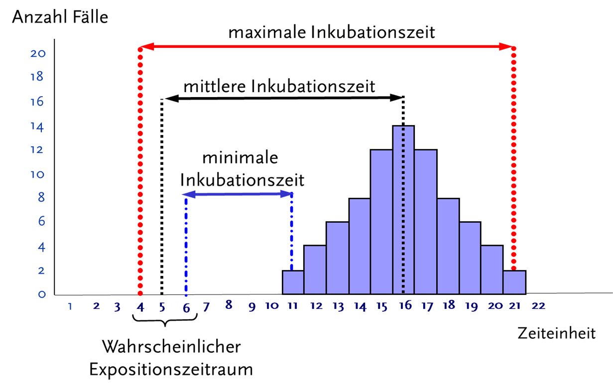

 

 
  
 
      &#9658; Inhaltsverzeichnis Kapitel (ausklappbar) 
  

 
1. TOC
{:toc}
 

 
   

 
 
Die
beiden Begriffe Ausbuchsmanagement und Ausbruchsuntersuchung wurden, und
werden, zum Teil synonym und zum Teil
unterschiedlich
verwendet.
Im
Folgenden
verstehen wir unter Ausbruchsmanagment "alle Aufgaben, die
eine
weitere
Verbreitung
einer
Infektionskrankheit
wirkungsvoll
und zügig zu
verhindern".
(KRINKO,
2002)

Unter
Ausbruchsuntersuchung verstehen wir
"die
zielgerichtete
infektions-epidemiologischen
Untersuchung
die die Bedrohung für die Bevölkerung
ermittelt,
die Infektionsquelle identifizieren und
Maßnahmen
die
versuchen
Folgefälle und ähnliche Ausbrüche in der Zukunft zu
verhindern.
(“Ausbruchsuntersuchungen,”
2014)

# Gründe für Ausbruchsuntersuchung

Die Lachsschaumspeise

Im Monty Python Film "Der Sinn des Lebens" gibt es eine Szene, in der
Freunde beim gemeinsamen Abendessen von "Mr. Death", dem Tod, besucht
werden. Er teilt ihnen mit, dass sie alle gestorben sind und er sie
jetzt mitnimmt. Einer der Gäste frägt "Warum sind wir gestorben?",
woraufhin seine Knochenhand auf eines der Gerichte zeigt: "Die
Lachsschaumspeise\!". Einer der Gäste wundert sich noch "Ich hab' die
doch gar nicht gegessen?\!?", bevor alle auf dem Tisch zusammenbrechen
um dann als Geister in ihre Geisterautos steigen und Mr. Death ins
Jenseits folgen.

"Woran sind Menschen im Ausbruch erkrankt und wie kann ich den Ausbruch
stoppen?" sind die Leitfragen für die Durchführung von
Ausbruchsuntersuchungen. Direkt daraus leitet sich dann oft die
praktische Intervention ab: beispielsweise Lebensmittelrückruf, die
Durchführung von Impfungen und Chemoprophylaxe und Barrieremaßnahmen,
Identifizierung von Schulungsbedarf bei \#Risikomaßnahmen (\#im Sinne
von Krankenhausprozeduren\#bitte besseres Wort) oder Erkennen von
Hygienebrüchen (\#?HACCP) (\#hier Verweis auf Kapitel Intervention\#).
Man möchte die Quelle des Ausbruchs finden und für die Zukunft
beseitigen, damit nicht noch mehr Menschen krank werden.

Manchmal findet man auch einen bisher unbekannten Erreger, wie z.B.
Legionellen, HIV, Ebola oder zuletzt SARS und SARS-CoV II. Ohne
strukturierte Ausbruchsuntersuchungen, die über die Einzelpatienten
hinaus die erkrankte und nicht-erkrankte Population miteinander
vergleichen, wären diese Erreger nie so schnell entdeckt worden.

Eine weitere Motivation für eine Ausbruchsuntersuchung ist der äußere
Druck durch die Medien oder positiver formuliert: das Eingehen auf die
Sorgen und Ängste der lokalen Bevölkerung. Die Entscheidung, welcher der
über 100 Norovirenausbrüche pro Saison im Kreis jetzt untersucht wird,
wird oft durch die Berichterstattung der Zeitungen oder Onlinemedien
bestimmt. Ein Ausbruch, über den in einer regionealen Zeitung mehrfach
berichtet wird, erzeugt so viel Druck bei den politisch Verantwortlichen
im Kreis und Landesministerium, dass die zuständigen Gesundheitsbehörden
nicht um eine strukturierte Untersuchung herumkommen.

Der einzige Top-Experte im Amt nutzt nichts, wenn er im Urlaub ist. Die
Veteranin im Gesundheitsamt hat hoffentlich vor der Altersteilzeit ihr
Wissen der nachfolgenden Generation weitergeben. Nein? Wieder von vorne
anfangen?
Eine letzte sehr wichtige Motivation für die Durchführung von
Ausbruchsuntersuchungen ist das Lehren und Lernen von praktischer
Ausbruchsepidemiologie.
Dabei
möchte Sie dieses Buch
unterstützen.

# Bausteine der Ausbruchsuntersuchung

Das
Vorgehen bei Ausbruchsunterschungen kann in mehr oder weniger destinkte
Aktivitäten
unterteilt
werden.
Diese Aktivitäten werden
häufig
in
ungefähr
10
"Arbeitsschritten"
aufgeführt,
die
meistens parallel und nicht in zeitlicher Abfolge
ablaufen.
Da es dabei nicht immer
einen
strengen
chornologischen Ablauf gibt, finden wir es
angebrachter,
diese
Aktivitäten
nicht
als
Schritte,
sondern
als
Bausteine
im
Sinne eines Puzzles,
einer
Ausbruchsuntersuchung
zu
betrachten, die
meistens
gleichzeitig
ablaufen
können:

(Bensyl,
Goodman, & Rasmussen, n.d., pp.
6–2)

[ECDC
FEM-Wiki](%20%20https://wiki.ecdc.europa.eu/fem/Pages/Outbreak%20investigations%2010%20steps,%2010%20pitfalls.aspx "  https://wiki.ecdc.europa.eu/fem/Pages/Outbreak investigations 10 steps, 10 pitfalls.aspx")

## **Baustein: Ausbruch bestätigen**

Zur
Identifizierung von
Clustern
(und Ausbrüchen) dient der
Der
Vergleich mit einer
Hintergrundrate.
Dieser
ist relativ einfach herzustellen, wenn Surveillance-Daten zur
Häufigkeit von bestimmten Infektionen bereits vorhanden sind.
DieseSolche
Daten können auch aus Literaturangaben stammen, z. B. die zu erwartende
Häufigkeit von MRSA-Nachweisen in den letzen Jahren in einer
neonatologischen Klinik. Allerdings muss verifiziert werden, welche
Definitionen den Routinedaten zugrunde liegen und ob mit ausreichender
Sensitivität und Spezifität erfasst
wurde.

Bereits
zu
diesem Zeitpunkt
sollten
verfügbare
Informationen gesammelt werden: 

  - Zeitpunkt und Ort des
    Auftretens
    des auffälligen
    Ereignisses

  - Informationen
    zu den betroffenen
    Personen
    (Linelist
    anlegen)

  - Informationen
    zum
    Erreger
    oder zum Krankheitsbild

  - Vorliegen von
    Risikofaktoren
    (Immunsuppression, hohes Alter, Begleiterkrankungen, spezielle
    berufliche
    Exposition)

  - die
    äußeren
    Umstände
    (Hitzewelle,
    im Krankenhaus z.B. Überbelegung und Personalmangel
    )
    
    Wenn
    die Frage: "Gibt es mehr Fälle als räumlich und zeitlich zu erwarten
    wären und stehen diese in einem epidemiologischen Zusammenhang?" mit
    ja beantwortet werden kann, dann liegt ein Ausbruch vor. Bei
    komplexen und protrahierten Ausbrüchen muss diese Frage im Verlauf
    mehrmals gestellt werden. Der Ausbruchsverdacht sollte zu
    Ermittlungen
    führen,
    in deren Rahmen sich herausstellen kann, dass
    kein
    Ausbruch vorliegt. Ein einzelner Fall kann bereits Grund für einen
    Ausbruchsverdacht sein und eine Ausbruchsuntersuchung nach sich
    ziehen (z.B. ein einzelner Nachweis von
    Ebola,
    Lassa
    oder
    Botulismus
    in Deutschland). 
    
    Neue Verfahren, wie die molekulare Surveillance und digitale
    Epidemiologie unterstützen vor allem bei der Identifizierung
    überregionaler Ausbruchsgeschehen (beispielsweise
    Listeriose-Ausbrüche) und bei nosokomialen Ausbrüchen
    (“Allgemeine Verwaltungsvorschrift über die
    Koordinierung des Infektionsschutzes in epidemisch bedeutsamen
    Fällen (IfSGKoordinierungs-VwV),”
    2013).

### *Ermittlungen in einem Ausbruch*

*Der
gesamte
Ausbruchsverlauf
einschließlich
eingeführter Infektionsschutz-Maßnahmen
sollte
beispielsweise in einem Protokoll
dokumentiert
werden.
Die Befundinterpretation erfolgt
überwiegend
durch die Mitarbeiter des Gesundheitsamtes. Dabei
sollte
ein Ermittlungsbogen gemäß § 25 IfSG mit folgenden Daten
ausgefüllt
werden:*

  - *Vor- und Nachname,*

  - *Geburtsdatum,*

  - *Adresse,*

  - *Telefonnummer der betroffenen Person,*

  - *seine berufliche Tätigkeit (z. B.: Lebenmittelberuf, Mitarbeiter
    einer Gemeinschaftseinrichtung),*

<!-- end list -->

  - *dem Erkrankungsbeginn,*

  - *die erste Arztkonsultation,*

  - *die Symptomatik,*

  - *den Krankenhausaufenthalt (von/ bis) und*

  - *die Infektionsquelle - sollte diese bekannt
sein.*

### *Kontaktpersonen*

*während
eines Ausbruchs kann es notwendig sein, Kontaktpersonen
zu
ermitteln. Hierbei sind folgende personenbezogene Daten durch den
Mitarbeiter des Gesundheitsamtes zu ermitteln:*

  - *der Vor- und Nachname,*

  - *das Geburtsdatum,*

  - *die Adresse und*

  - *die
    Telefonnummer,
    E-Mail.*

## Baustein: Teambildung und -strukturierung

Die Zusammensetzung des Ausbruchsteams richtet sich nach den besonderen
Erfordernissen des jeweiligen Ausbruchs und weist damit eine gewisse
Variabilität auf. Eine Übersicht über zentrale Rollen, welche bei jedem
Ausbruch anfallen ist in
tabellarischer
Form im Folgenden dargestellt. Darüber hinaus können je nach Art
der Ausbruchs weitere Aufgaben hinzukommen, welche in nachfolgenden
Kapiteln weiter charakerisiert werden. Zur Aufgabe der leitenden Person
eines Ausbruchsteams gehört es sicherzustellen, dass alle benötigte
Aufgaben erfüllt werden können. Um dies zu gewährleisten bietet es sich
an eine Übersicht über die zu leistende Arbeit heranzuziehen, z.B.
im
Kapitel 2 eingeführte Aktivitätenliste der
PSP
(Projektstrukturplan).
Jeder Aktivität der Aktivitätenliste wird im Folgenden eine konkret
verantwortliche Person zugeordnet. Diese Person trägt die Verantwortung
für die Erfüllung des Arbeitspakets und ist verantwortlich für
regelmäßige Statusberichte an die Leitung. Auf diesem Weg wird eine
Verantwortungsdiffusion verringert und eine doppelte Bearbeitung
einzelner Arbeitsschritte
verhindert.

Bei
einem Ausbruch ist es wichtig, die für die Durchführung von
Kontrollmaßnahmen verantwortlichen Personen,
frühzeitig
in das Team einzubinden und von ihrer
Verantwortung
zu überzeugen. Bei nosokomialen Ausbrüchen ist beispielsweise
häufig der Ärztliche Direktor verantwortlich für die Hygiene im
Krankenhaus.
Das Ausbruchsteam besteht folglich nicht immer lediglich aus Mitglieder
der bearbeitenden Behörden, sondern kann auch externe Akteure mit
einbeziehen. 

<table>
<colgroup>
<col style="width: 25%" />
<col style="width: 25%" />
<col style="width: 25%" />
<col style="width: 25%" />
</colgroup>
<tbody>
<tr class="odd">
<td>
Gastro
</td>
<td>
Aufgabe
</td>
<td>
Wer kann diese übernehmen
</td>
<td>
Inhalt der Aufgabe
</td>
</tr>
<tr class="even">
<td></td>
<td>
Annahme und Verarbeitung der Meldung
</td>
<td>
-
</td>
<td>
-Ermittlung: Zeit, Ort, Person, Kontakte, Infektionsquelle/Exposition, Krankenhausaufenthalt, Symptomatik, Reiseanamnese, Berufliche Tätigkeit (§33, 42)

-Dokumentation Ansprechpartner
</td>
</tr>
<tr class="odd">
<td></td>
<td>
Probennahme
</td>
<td></td>
<td>
-Stuhl/Urin/Rachen

-Lebensmittel

-Haustiere
</td>
</tr>
<tr class="even">
<td></td>
<td>
Bildung Ausbruchsteam
</td>
<td></td>
<td>
-Zusammenstellung notwendiger Personen
</td>
</tr>
<tr class="odd">
<td></td>
<td>
Probenverarbeitung
</td>
<td></td>
<td>
-Kontaktierung der entsprechenden Labors

-Durchführung der Testungen

-Implementation der Ergebnisse
</td>
</tr>
<tr class="even">
<td></td>
<td>
Ressourcenbereitstellung
</td>
<td></td>
<td></td>
</tr>
<tr class="odd">
<td></td>
<td>
Meldung an übergeordnete Stellen
</td>
<td></td>
<td>
-Information der lokalen Leitung

-Information der übergeordneten Ämter/Institute
</td>
</tr>
<tr class="even">
<td></td>
<td>
Belehrung Betroffener
</td>
<td></td>
<td>
-Aufklärung: Hygiene, Desinfektionsmaßnahmen, Übertragungswege, Prophylaxe, Weitere Maßnahmen

-Aussprechen von Berufsverboten
</td>
</tr>
<tr class="odd">
<td></td>
<td>
Ausübung von Absonderungsmaßnahmen
</td>
<td></td>
<td></td>
</tr>
<tr class="even">
<td></td>
<td>
Information der Öffentlichkeit
</td>
<td></td>
<td>
-Informationsweiterleitung an Pressestelle
</td>
</tr>
</tbody>
</table>

Tabelle:
Rollen während eines
Ausbruchs

### Dokumentation von Treffen

Um
Absprachen und wichtige Entscheidungen zu dokumentieren ist es wichtig
dass
vor
relevanten Treffen Dokumentationen angefertig
werden.

####  Vorlage: Protokoll Teamtreffen

(Titel)
Treffen Team Ausbruchsuntersuchung

(Datum, Zeit und Ort)

1\. Festlegen: Vorsitz, Protokoll, Zweck des Treffens

2\. Anwesende, entschuldigte Teilnehmende

3\. Agenda (erstellen)

4\. Protokoll der vorangegangenen Sitzung

5\. Standortbestimmung / Überprüfung der Evidenz

\- Epidemiologisch

\- Mikrobiologisch

\- Umwelt- und Nahrungsmittelkette

6\. Aktuelle Risikobewertung

7\. durchgeführte Kontrollmaßnahmen

8\. Weitere geplante Untersuchungen

\- Epidemiologisch

\- Mikrobiologisch

\- Umwelt- und Nahrungsmittelkette

9\. Kommunikation / Mitteilungen an

\- Öffentlich

\- Medien

\- Leistungserbringer im Gesundheitswesen (z.B. Hausärzte, A\&E etc...)

\- Andere

10\.
Aufgaben,
Verantwortliche
und Zeiträume bestimmen

11\. Verschiedenes

12\. Datum der nächsten
Sitzung

## **Baustein: Diagnose sichern**

Zu
Beginn einer Ausbruchsuntersuchung, aber auch im Verlauf, sollte
überprüft werden, ob oder in welchem Ausmaß das Geschehen auf klinisch
oder labordiagnostische Unsicherheiten zurückzuführen sein könnte.
Verändertes Testverhalten, oder Testverfahren, Veränderungen in der
Aufmerksamkeit von
Ärzten/Ärztinnen
können zu Nachweishäufungen führen, sogenannten
Pseudoausbrüchen.

KASTENBeispiel:
Blutspender werden zunehmend auch auf Hepatitis-E gescreent. Durch die
Labormeldepflicht erhöht sich dadurch die Fallzahlen im Vergleich zu den
Vorjahren, ohne dass ein Ausbruch
vorliegt.

Bei
Pseudoausbrüchen
handelt
es sich nicht um tatsächliche Erkrankungs- oder Erregerhäufungen,
sondern um Häufungen von deren Nachweis. Ziel dieses Bausteins ist
es,
so früh wie möglich differenzieren zu können zwischen Ausbruch und
Pseudoausbruch. Dazu eigenen sich folgende
    Maßnahmen:

  - Klinische
    Diagnostik: durch systematische Patientenuntersuchungen und
    Hinzuziehung von Experten können Unsicherheiten reduziert werden.
    Häufig ist eine systematische Auswertung einzelner Patientenakten
    oder von Arztbriefen ausreichend.
    

  - Patienteninterviews
    oder Interviews von Behandlungspersonals sind ebenfalls sehr
    hilfreich, um nachzuvollziehen, ob ähnliche Erkrankungssymptome
    vorliegen
    oder
    nicht.
    

  - Klinische Proben und Materialien, die möglicherweise mit dem
    Ausbruch in
    Verbindung
    stehen, müssen
    schnellstmöglich
    untersucht werden und sollten aufbewahrt werden, bis geklärt
    ist, ob
    weiterführende
    Untersuchungen notwendig sind.

  - Bei bereits
    durchgeführten
    Untersuchungen sollten die verwendeten Methoden abgeklärt
    werden:
    welches Probenmaterial, welche
    Entnahmetechnik,
    Transport (Temperatur? Kontaminationsmöglichkeit? etc.), Versand,
    Labormethoden. Nationale Referenzzentren und Konsiliarlabore können
    bei der Evaluation der Erregerdiagnostik im Ausbruchsfall
    unterstützen
    ([https://www.rki.de/DE/Content/Infekt/NRZ/nrz\_node.html](https://www.rki.de/DE/Content/Infekt/NRZ/nrz_node.html "https://www.rki.de/DE/Content/Infekt/NRZ/nrz_node.html")).

  - Erregertypisierung:
    Im Rahmen einer Ausbruchsuntersuchung können
    Typisierungsverfahren von
    Erregern
    unterhalb der Speziesebene eine sinnvolle und notwendige
    Ergänzung sein, wenn sie
    dazu
    dienen, die Sicherung der Diagnose
    oder/und
    Falldefinition zu
    ermöglichen
    oder Transmissionsketten aufzuklären.
    Bei
    der Aufklärung lebensmittelassoziierter Infektionen kann die
    Erregertypisierung zum Abgleich von Human- und Lebensmittelisolaten
    eingesetzt werden. Eine
    Typisierung
    muss nicht in jedem Fall durchgeführt
    werden;
    z.B. kann bei seltenen Erregern oder ohnehin
    eindeutigen
    Falldefinitionen
    auf
    eine Typisierung verzichtet
    werden.  
    Zu beachten: Es gibt kein 100% ideales
    Typisierungsverfahren
    und es gibt Ausbrüche bei denen in der
    Infektionssquelle
    oder auf dem Vektor
    mehrere
    Erreger vorkommen
(Multispeziesausbrüche).

## **Baustein: Falldefinition erstellen**

Für
jede Ausbruchsuntersuchung wird eine Falldefinition
erstellt.
Die Falldefinition ist ein
Instrument,
anhand dessen standardisiert und nachvollziehbar entschieden werden
kann,
welche Erkrankungsfälle

dem
Ausbruch zugeordnet werden und welche nicht.

Wichtig:
Die
**Ausbruchsfalldefinition
**ist
nicht dasselbe wie die
**Falldefinition**,
die vom RKI für die Übermittlung von Erkrankungsfällen erstellt werden.

Zu Beginn der Ausbruchsuntersuchung ist die Falldefinition sensitiv, das
heißt, es sollen möglichst viele Erkrankungsfälle, die zum Ausbruch
gehören, erfasst werden \[Bsp. Falldefintion siehe
unten:
Kinder mit gastrointestinalen Symptomen\]. Dafür nimmt man in Kauf, dass
vielleicht auch Erkrankungsfälle erfasst werden, bei denen sich später,
z.B. mit entsprechender Labordiagnostik, herausstellt, dass sie doch
nicht zum Ausbruch gehören (Falsch-Positive) \[im Bsp. Falldefintion
siehe
unten:
Kinder, die aus anderen Gründen Bauchschmerzen hatten\]. Die
Ausbruchsfalldefinition ist flexibel und kann sich im Verlauf der
Ausbruchsuntersuchung ändern, wenn neue Erkenntnisse gewonnen werden,
die eine Anpassung der Falldefinition erforderlich machen.

Im Verlauf der Ausbruchsuntersuchung kann sie zunehmend spezifischer
werden. Mit einer **spezifischen Falldefinition** werden nur die
Erkrankungsfälle erfasst, die wirklich zum Ausbruch gehören und die, die
nicht zum Ausbruch gehören, können ausgeschlossen werden.
Eine
Falldefinition
basiert
auf objektiven Kriterien (z.B. klinische Symptome, labordiagnostische
Ergebnisse), und sollte immer die epidemiologischen Aspekte
Zeit,
Ort, Person
(ZOP)
enthalten.
Unter
dem Aspekt Zeit wird beschrieben, wann die Erkrankungsfälle, die dem
Ausbruch zugerechnet werden sollen, aufgetreten sind. Unter dem Aspekt
Ort wird beschrieben, wo die Erkrankungsfälle aufgetreten sind (z.B.
Landkreis XY, Schule Z in Landkreis XY, Firma A). Unter dem Aspekt
Person werden die betroffenen Personen (z.B. Schülerinnen und Schüler
der Klasse 4c) und häufig auch deren Symptome beschrieben (z.B.
Schülerinnen und Schüler der Klasse
4c
mit Durchfall und/oder Bauchschmerzen).

Beispiel
Falldefinition:
Als Fälle des Ausbruchs werden Schülerinnen und Schüler der Klasse 4c
bezeichnet \[PERSON\] der XY-Schule in Z \[ORT\], die in den 7 Tagen
nach dem Besuch der Schulklasse 4c auf dem Bauernhof X an x.x.20xx
\[ZEIT\]mit Durchfall und/oder Bauchschmerzen erkrankt \[PERSON\] sind.

Beispiel
für eine spezifischere Falldefinition: Als Fälle des Ausbruchs
werden Schülerinnen und Schüler der Klasse 4c bezeichnet \[PERSON\] der
XY-Schule in Z \[ORT\], die in den 7 Tagen nach dem Besuch der
Schulklasse 4c auf dem Bauernhof X an x.x.20xx \[ZEIT\]mit Durchfall
und/oder Bauchschmerzen erkrankt
sind
und bei denen labordiagnostisch eine
Campylobacter-jejuni-Infektion
nachgewiesen wurde \[PERSON\]
.

In
Ausbruchsuntersuchungen unterscheidet man häufig die
**Fallkategorien**
Verdachtsfälle/mögliche Fälle, wahrscheinliche Fälle und
gesicherte/bestätigte Fälle. Für jede Fallkategorie muss eine
Falldefinition erstellt werden.

## **Baustein: Weitere Fälle suchen**

Auf der Grundlage der bisher gewonnen Daten und mit Hilfe **der
Falldefinition** müssen weitere Fälle ermittelt werden. Dies ist
insbesondere dann wichtig, wenn es sich um schwerwiegende Erkrankungen
handelt und wenn der Erkrankungserreger von Person zu Person übertragen
werden kann. Insbesondere bei Ausbrüchen auf Grund von Personen zu
Personen Übertragung in Krankenhäusern, können die
Infektionsschutzmaßnahmen nur dann erfolgreich sein, wenn alle Fälle
identifiziert wurden. Bei anderen Ausbrüchen, kann es ausreichend sein,
im Verlauf der Untersuchung Erkenntnisse zu sammeln, wie groß die
aktuelle Unterschätzung der Fallzahlen
sein
könnte
(eher
Faktor 2 oder
10?)
(Haagsma et al., 2013).

Je nach Krankheitsbild oder Erreger benötigt man eine Strategie zur
Fallsuche: Wenn es relevant ist, auch symptomlose Personen, also alle
Träger
und Trägerinnen bzw. alle Kolonisierten zu identifizieren, dann
müssen systematische Untersuchungen durchgeführt werden. Dazu muss die
zu untersuchende Gruppe sinnvoll gewählt und
Screeninguntersuchungen
organisiert werden. Dies sollte in enger Abstimmung mit den beteiligten
Laboren erfolgen.
Als
Screeninguntersuchungen
kommen z.B. auch seroepidemiologische Untersuchungen in Frage.

Alle Daten sollten mit
Hilfe
eines standardisierten
Erfassungsbogens
erfasst werden. Damit soll sichergestellt werden, dass keine
wichtigen Informationen vergessen werden und beispielsweise Kranken-,
Labor- und sonstige Akten nicht mehrmals durchgesehen werden müssen. Die
zu sammelnden Informationen umfassen demographische Daten
(Identifikation des Falles, Geburtsdatum, Geschlecht), klinische
Symptomatik (Art, Beginn, Ende, Ausprägung, betroffene Körperbereiche),
gegebenenfalls das Datum der Krankenhausaufnahme, evtl. auch der
Krankenhausentlassung, der Station (bei mehreren Stationen: Daten des
Aufenthaltes auf jeder Station), relevante Laborbefunde (Datum der
Entnahme, Art der Proben, untersuchendes Labor, evtl. angewandte
Methode,
Ergebnis)
und
Grundkrankheiten des
Patienten.

## **Baustein: Ausbruch beschreiben**

Zu
Beginn einer Ausbruchsuntersuchung werden Erkrankungsfälle ausführlich
befragt, um Gemeinsamkeiten zwischen den Erkrankungsfällen zu finden
und dadurch die Ausbruchsursache zu
ermitteln
(explorative
bzw.
Hypothesen-generierende
Befragungen,
alternativ:
"Shotgun-Fragebogen"
(sehr
ausführlicher
Fragebogen, der zur Hypothesen-Generierung genutzt werden
kann).
Eine
deutsche Version des Shotgun-Fragebogens
kann
beim RKI angefordert
werden
(“Shotgun-Questionnaire,”
2014).
Erhobene
Informationen
über
die
Erkrankungsfälle
werden systematisch dokumentiert (sogenannte
Line-Liste
oder
zu
deutsch
Ur-Liste).
In der Line-Liste, z.B. eine Excel-Tabelle, wird für jeden
Erkrankungsfall
eine
Zeile in der Tabelle angelegt, in der alle vorliegenden Informationen zu
dem Fall dokumentiert werden.
Informationen,
die erhoben werden, umfassen
neben
einer Identifikationsnummer für jeden Fall
demografische
(Name,
Wohnort,
Kontaktdaten,
Alter,
Geschlecht)
und
klinische
Angen
(Symptomatik, Erkrankungsbeginn, Hospitalisierung,
Diagnostik).
Für
lebensmittelbedingte Ausbrüche bietet das RKI ein
Excel-basiertes
Linelist-Werkzeug
an, das über die Erfassung der Informationen hinaus auch
einige
Datenauswertungen
ermöglicht
\[[LINELIST-Werkzeug](%20https://www.rki.de/DE/Content/InfAZ/L/Lebensmittel/Linelist-Tool/Linelist_Werkzeuge_Tab_gesamt.html "LINELIST-Werkzeug")\].
Im
Linelist-Werkzeug
können
zusätzlich zu den
demografischen
und klinischen Angaben
auch
Informationen
zu vor Erkrankungsbeginn
verzehrten
Lebensmitteln
erfasst werden.

Alle
vorliegenden
Informationen
zum
Ausbruch werden zur Ausbruchsbeschreibung geordnet,
wobei
wieder die
**Aspekte
Zeit, Ort und Person
(ZOP)**
berücksichtigt werden.

Unter
dem
**Aspekt
Zeit**
wird beschrieben, wann der Ausbruch stattgefunden hat. Dafür wird eine
Epidemiekurve erstellt, die
grafische
die Anzahl der Erkrankungsfälle nach der
Zeit
ihres Auftretens
darstellt.
Auf der X-Achse der Epidemiekurve kann z.B. der Erkrankungsbeginn (Tag)
dargestellt sein, auf der Y-Achse die Anzahl der Fälle, die an dem
jeweiligen Tag erkrankt sind.

Die
Epidemiekurve ist für die Ausbruchsuntersuchung ein wichtiges
Instrument. Anhand der Epidemiekurve kann die Dynamik und das Ausmaß des
Ausbruchs dargestellt
werden
(Punktquelle oder fortbestehende
Infektionsquelle).
Auch kann die Form der Epidemiekurve wertvolle Hinweise auf den
Übertragungsweg des Erregers
liefern
(z.B.
Mensch-zu-Mensch-Übertragung).
Anhand der Epidemiekurve kann u.U. der mögliche Infektionszeitraum
bestimmt werden (wenn der Erreger und die Inkubationszeit für den
Erreger bekannt ist). Wenn der genaue Expostionszeitpunkt
der
Erkrankungsfälle
bekannt
ist (z.B. eine Familienfeier) aber der Krankheitserreger noch unbekannt
ist, kann anhand der Epidemiekurve die Inkubationszeit für den Erreger
abgeschätzt und damit zusätzliche Hinweise auf den Erreger erlangt
werden.

Unter
dem
**Aspekt
Ort**
wird beschrieben, wo sich der Ausbruch ereignete. Eine Darstellung mit
Landkarten, auf der die Orte, wo Fälle aufgetreten sind, dargestellt
werden, kann hilfreich sein
(Punktkarte;
pro Erkankungsfall ein
Punkt).
Dabei ist zu beachten, dass aus Datenschutzgründen nicht
die
genauen
Wohnorte
der Erkrankungsfälle zu erkennen sein sollte. Eine Inzidenzkarte, auf
der die Inzidenzen, z.B. in verschiedenen Landkreisen, farblich
kodiert
dargestellt
werden, ist
eine
andere Darstellungsmöglichkeit.

Unter
dem
**Aspekt
Person**
werden die vorliegenden Informationen über die Erkrankungsfälle
beschrieben. Dazu gehören Geschlecht und Alter (Altersdurchschnitt,
Altersspanne, ggf. Altersgruppen) der Erkrankten.
Auffälligkeiten,
z.B. dass vor allem alte Menschen oder Kleinkinder, betroffen sind,
können wertvolle Hinweise auf die Ausbruchsursache oder das
Infektionsvehikel geben. In manchen Ausbruchsuntersuchungen kann es
wichtig sein, die Berufsgruppe (z.B. Tierärzte/Tierärztinnen;
Waldarbeiter/Waldarbeiterinnen) oder besondere Freizeitaktivitäten (z.B.
Jagen) zu erfassen, um
Hinweise
auf die
Ausbruchsursache
zu
entdecken.
Auch
die Symptome der Erkrankten, Datum der Erkrankungsbeginne,
Erkrankungsbeginn des ersten und des bisher letzten
Fall
im
Ausbruch,
Anzahl
der Fälle,
Anzahl
der Hospitalisierungen, Anzahl der Todesfälle und labordiagnostische
Ergebnisse
gehören
zur Beschreibung
eines
Ausbruchs.

Insbesondere
bei
Ausbrüchen
im Gesundheitswesen und in Gemeinschaftseinrichungen können integrierte
Darstellung von
Person,
Ort
und
Zeit
hilfreich sein. Eine einfache
Darstellungsform
ist eine
Zeitschiene
(engl.
timeline).
Dabei wird jeder Fall in einer Zeile dargestellt. Beispiel für
eine
Zeitschiene
(Haller,
2015):

Darüberhinaus
können Netzwerkanalysen hilfreich sein, um Infektionsketten zu
visualisieren und nachzuvollziehen.

Anhand
der
Ausbruchsbeschreibung können Hypothesen
hinsichtlich
der Ausbruchsursache, der Infektionsquelle und des Ausbruchserregers und
seinem Übertragungsweg entwickelt werden.

## **Baustein: Hypothese entwickeln**

Um
eine Hypothese zum Infektionsvehikel bzw. zur
Ausbruchsursache
entwickeln zu können, werden
alle
vorliegenden
Informationen
herangezogen.
Die
Entwicklung von Hypothesen in einem Ausbruchsgeschehen ist ein
dynamischer Prozess, weil neue Ermittlungserkenntnisse dazu zu neuen
Hypothesen oder zur Verwerfung früherer Hypothesen führen.
In
der frühen Phase einer Ausbruchsuntersuchung werden die Erkrankten
ausführlich explorativ befragt. Ziel dieser Befragungen ist es,
Gemeinsamkeiten zwischen den Erkrankungsfällen zu entdecken (z.B.
gemeinsame Exposition auf einer Familienfeier). Dabei werden
Erkrankungsfälle strukturiert, am besten mit einem Fragebogen,
befragt.
Der Fragebogen kann offene Fragen (Bsp: An welchen Veranstaltungen haben
Sie in den 7 Tagen vor Ihrem Erkrankungsbeginn teilgenommen?) und
geschlossene Fragen (Bsp: Haben Sie in den 7 Tagen vor Ihrem
Erkrankungsbeginn rohes Hackfleisch gegessen?) enthalten. Offene Fragen
bieten bei einer explorativen Befragung den Vorteil, dass auch
Informationen erfasst werden können, an die die Befragenden vorher nicht
gedacht haben und die für die Ausbruchsaufklärung richtungsweisend sein
könnten.
Befragungen
können telefonisch, schriftlich (Fragebogen per Post), online oder
face-to-face durchgeführt
werden.
Bei lebensmittelbedingten Ausbrüchen kommen auch
die
oben
genannten
"Shotgun"-Fragebögen
(=explorative
Fragebögen)
zum Einsatz, mit denen der Verzehr einer Vielzahl von Lebensmitteln in
den Tagen vor dem Erkrankungsbeginn, aber auch Ernährungsgewohnheiten
standardisiert abgefragt werden können.

Aus
allen vorliegenden Informationen wird eine Hypothese (oder
mehrere)
entwickelt, was zu den Erkrankungen geführt haben könnte. Bei einem
lebensmittelbedingten Ausbruch wäre die Hypothese, dass der Verzehr
eines bestimmten Lebensmittels, z.B. rohes Hackfleisch, in Zusammenhang
mit den Erkrankungen im Ausbruchsgeschehen steht (z.B. Salmonellosen).

## **Baustein: Hypothese prüfen**

Wenn
eine Hypothese entwickelt worden ist, kann diese im nächsten Schritt
geprüft werden.
Dafür
können bei Ausbruchsuntersuchungen analytische epidemiologische Studien
durchgeführt werden. Häufig verwendete Studiendesigns sind
Kontrollstudien und Fall-Kontroll-Studien. Im Unterschied zu
den
explorativen
Befragungen,
die nur bei erkrankten Personen durchgeführt werden,  werden bei
einer analytischen epidemiologischen Studie
sowohl
Personen befragt, die erkrankt
waren,
als auch Personen, die
im
Ausbruchsgeschehen nicht erkrankt waren. Für analytische Studien
werden
meist
relativ kurze Fragebögen verwendet, die überwiegend geschlossene
Fragen
(mit den Antwortmöglichkeiten Ja/Nein/ggf. Weiß nicht)
enthalten.

Die
Durchführung von Kontrollstudien bietet sich bei Ausbrüchen an, die sich
auf einen offensichtlichen gemeinsamen Expositionsort der
Erkrankten
zurückgeführt werden können (z.B. Ausbrüche nach einer Familienfeier).
Unter einer Kohorte versteht man eine definierte, geschlossene
Personengruppe, z.B. alle Gäste einer Familienfeier. In einer Kohorte
befinden
sich
Personen,
die eine bestimmte Exposition hatte, z.B. auf der Familienfeier Tiramisu
gegessen haben, und Personen, die dieser Exposition nicht ausgesetzt
waren,
also
das Tiramisu nicht gegessen haben.
Kohortenstudien
in Ausbruchsuntersuchungen sind häufig retrospektiv. Zu dem Zeitpunkt,
wenn die Studie durchgeführt wird, sind Expositions- und
Krankheitsstatus bekannt und können
mit
Hilfe eines Fragebogens
erfasst
werden.
Die
erfassten Daten werden zur Auswertung in sogenannte Vierfeldertafeln
eingetragen. Anhand der Vierfeldertafeln wird das Erkrankungsrisiko der
Exponierten berechnet und das Erkrankungsrisiko der Nicht-Exponierten
berechnet. Das Erkrankungsrisiko der Exponierten wird dann ins
Verhältnis zum Erkrankungsrisiko der Nicht-Exponierten gesetzt, um das
Relative Risiko zu berechnen. Das Relative Risiko stellt bei
Kohortenstudien das Maß für die Stärke des Zusammenhangs zwischen der
Exposition und der Erkrankung dar, d.h. der Zusammenhang ist umso
stärker, je höher das Relative Risiko ist. Ein
berechnetes
Relatives
Risiko von 1 bedeutet, dass ein Zusammenhang zwischen der Exposition und
den Erkrankungen nicht wahrscheinlich ist, weil das Erkrankungsrisiko
der Exponierten in etwa so hoch ist wie das Erkrankungsrisiko der
Nicht-Exponierten.
Ist das berechnete Relative Risiko größer als 1, weist dies auf einen
positiven Zusammenhang zwischen der Exposition und den Erkrankungen hin.

In
Ausbruchsgeschehen bietet sich die Durchführung einer
Fall-Kontroll-Studie an, wenn die Exposition der Erkrankten nicht auf
einen gemeinsamen Expotionsort zurückgeführt werden kann und die
Erkrankungsfälle verstreut auftreten. In einer Fall-Kontroll-Studie
werden erkrankte und nicht
erkrankte
Personen hinsichtlich ihrer Expositionen
befragt.
Im Unterschied zur Kohortenstudie werden die Studienteilnehmenden nach
ihrem Erkrankungsstatus ausgewählt. Erkrankte Personen werden als Fälle
bezeichnet, nicht-erkrankte Personen als Kontrollen. Als Maß für den
Zusammenhang zwischen Exposition und Erkrankungen wird die Odds Ratio
berechnet.
Dafür
wird die Odds (Chance) der Fälle, exponiert gewesen zu sein, ins
Verhältnis gesetzt zu der Odds (Chance) der Kontrollen, exponiert
gewesen zu sein. Eine besondere Herausforderung von
Fall-Kontroll-Studien ist es, geeignete Kontrollpersonen zu finden.
Die Kontrollpersonen in einer Fall-Kontroll-Studie sollten
dieselbe Gelegenheit gehabt haben, exponiert gewesen zu sein
wie
die Fälle.
Wenn
in Gesundheitsämtern die Durchführung einer Fall-Kontroll-Studie geplant
ist, wird empfohlen, sich vorher
eine
statistische
Beratung
einzuholen
oder sich an ihre Landesgesundheitsbehörde oder das RKI zu wenden.

Für
lebensmittelbedingte Krankheitsausbrüche bietet das Excel-basierte
[LINELIST-Werkzeug](https://www.rki.de/DE/Content/InfAZ/L/Lebensmittel/Linelist-Tool/Linelist_Werkzeuge_Tab_gesamt.html "LINELIST-Werkzeug")
des
RKI die Möglichkeit, Relative Risiken bzw. Odds Ratios zu
berechnen
(Siehe
dazu auch die Veröffentlichung von Werber & Bernard, 2014).

Maßzahlen wie Relatives Risiko oder Odds Ratio werden meist mit einem
95%-igen Konfidenzintervall (Vertrauensbereich) angegeben. Wenn die
Studie beliebig oft wiederholt werden könnte, würde in 95% der Studien
der wahre Wert für die Maßzahl in dem angegebenen Vertraunensbereich
liegen. Als Faustregel kann man sich Folgendes merken. Wenn die 1,0 im
Konfidenzintervall liegt, dann ist das Ergebnis (Relatives Risiko oder
Odds Ratio) wahrscheinlich nicht statistisch signifikant (wenn man einen
statistischen Test machen
würde).

Nicht
in jeder Ausbruchsuntersuchung ist es nötig oder möglich, eine
analytische epidemiologische Studie (Kohortenstudie oder
Fall-Kontroll-Studie)

durchzuführen. Eine analytische Studie sollte dann in Erwägung gezogen
werden, wenn die bereits vorliegende Evidenz für den Zusammenhang
zwischen einer Exposition (z.B. dem Verzehr eines bestimmten
Lebensmittels) und den Erkrankungen nicht ausreichend ist. Bei
lebensmittelbedingten Ausbrüchen kann häufig keine labordiagnostische
Evidenz mehr erzeugt werden, weil keine Lebensmittel
mehr
vorhanden
sind, die beprobt werden könnten, oder weil ein Erregernachweis im
Lebensmittel nicht gelingt. Die ausschließliche Befragung von
Erkrankten (ohne Vergleichsgruppe) lässt häufig keine Eingrenzung auf
ein einziges
Lebensmittel
als wahrscheinliches Infektionsvehikel
zu,
da
Lebensmittel,
welche
von Erkrankten häufig verzehrt werden, auch von Gesunden häufig verzehrt
werden, wenn es sich um beliebte Lebensmittel handelt. 

Eine analytische Studie ist nur ratsam, wenn eine Hypothese vorliegt,
die mit Hilfe der analytischen Studie getestet werden kann.
Sie
ist jedoch nicht möglich, wenn zu wenige Erkrankte/Fälle (oder
Kontrollen) zur Verfügung stehen, so dass das erwartete Ergebnis der
Studie nicht aussagekräftig oder belastbar
ist.
Eine
analytische Studie ist
hingegen
nicht
nötig, wenn die vorhandene Evidenz ausreichend ist, um Maßnahmen
ergreifen zu können, mit denen der Ausbruch gestoppt und
weitere
Erkrankungen verhindert werden
können.

Bei der Interpretation der Ergebnisse von analytischen Studien sind
zufällige
Assoziationen,
mögliche Verzerrungen (Bias) und Confounding zu berücksichtigen, die in
Lehrbüchern der Epidemiologie erklärt sind.

Auch
ist zu beachten, dass die Interpretation
der
Odds Ratios in einer Fall-Kontroll-Studie von der Art der
Kontrollauswahl abhängt und entweder als relatives Risko, die relative
Rate oder
der
Inzidenz Odds Ratio einer zugrundeliegenden hypothetischen Kohorte
interpretiert werden kann (PEARCE,
1993).

## **Baustein: Maßnahmen ergreifen**

Kontrollmaßnahmen
müssen im Ausbruchsgeschehen so früh wie möglich ergriffen werden, damit
der Ausbruch gestoppt und weitere Erkrankungsfälle verhindert werden
können.
Kontrollmaßnahmen
müssen
im Verlauf des Ausbruchsgeschehens
ständig
evaluiert und gegebenenfalls angepasst werden. Die Kontrollmaßnahmen
betreffen eine Fülle von möglichen Aktivitäten, die in den verschiedenen
Verordnungen und
Gesetzen
der Länder und des Bundes aufgeführt sind oder im Ermessen
der
verantwortlichen
Behörden
liegen
und in anderen Abschnitten genauer dargestellt werden.

Dieser
Baustein wird im Rahmen der Ausbruchsuntersuchung explizit erwähnt, da
es in der Verantwortung des Ausbruchsteams liegt, alles zu tun,
damit
nötige
Kontrollmaßnahmen
eingeleitet
werden
können.
So
muss sichergestellt werden,
dass
Ergebnisse
epidemiologischer
Untersuchungen zu möglichen
Übertragungswegen
die
dadurch
implizierten Kontrollmaßnahmen nach sich ziehen.
Häufig
liegen
die
Zuständigkeiten
nicht allein im ÖGD,
die
Umsetzung
der implizierten
Kontrollmaßnahmen
muss aber durch
das
Ausbruchsteam
entsprechend
empfohlen
und überprüft werden.
Ein
klassische
Beispiel hierführ ist das Abschrauben des Pumpenhebels der "Broad Street
Pump" durch John Snow,
bei
einem

Choleraausbruch
in London im
19.Jahrhundert.
Weitere
Kontrollmaßnahmen können z.B. Hygienemaßnahmen,
Riegelungsimpfungen,
medikamentöse
Prophylaxe,
Tätigkeitsverbote
und bei lebensmittelbedingten Ausbrüchen Lebensmittelrückrufe sein, die
von den Lebensmittelüberwachungsbehörden veranlasst werden.
Die
Implementation von Maßnahmen benötigt stärker als andere Elemente eine
solide Rechtfertigungsbasis im Sinne einer konsequenten Beweisführung
der Ausbruchsursache um auch spätere juristische Konsequenzen zu
minimieren.

## **Baustein: Kommunizieren**

Der
effektiven Risiko- und Krisenkommunikation im Rahmen eines
Ausbruchsmanagemts kommt eine bedeutende Rolle
zu.

Zur
effektiven Kommunikation im Rahmen eines Ausbruchsmanagements gehören
sowohl die Information aller Akteure untereinander, als auch die
Information
der Fachöffentlichkeit und der Öffentlichkeit sowie die
Informationsweitergabe
an und durch die Medien. "Transparenz ist hierbei oberstes Gebot, um
behördliche Entscheidungen und Hinweise zum Schutzverhalten für die
Bevölkerung sowie für die Fachöffentlichkeit nachvollziehbar zu
vermitteln."
(Praktische
Aspekte
XXX QUelle)

Kommunikation muss dabei situations- und lagebedingt sein. Bei einem
kleinen Ausbruch kann es beispielsweise sein, dass gar keine
Pressemitteilung verfasst, oder erst nach Presseanfrage eine Mitteilung
herausgegeben wird. Während eines großen Ausbruchsgeschehen ist jedoch
die Verunsicherung der Bevölkerung groß. Hier ist von Anfang an " mit
einem massiven Bedarf an Informationen und Kommunikation zu rechnen"
(Epid. bed. Lagen Link) diesem sollte man frühzeitig mit adäquaten
Methoden der Krisenkommunikation und unter Nutzung aller Medien
erfolgen.
Hierbei
kann es hilfreich sein die zuständige Presseabteilung bereits vorab mit
Informationen zu versorgen, sodass im Bedarfsfall schnell auf Anfragen
reagiert werden kann. 

Gesetzlich vorgeschriebene Meldewege (§§ 6 und 7 Infektionsschutzgesetz)
müssen, wie
bereits
im Kapitel Vorbereitung
(Dokumente
@Editor: Bitte internen Link
einfügen)
beschrieben, eingehalten werden (IfSG). In der Regel werden die
benötigten Meldebögen durch die Länder bereitgestellt. Meldebögen, die
nach den Internationalen Gesundheitsvorschriften (IGV) eine mögliche
gsundheitliche Notlage von internationaler Tragweite beinhalten (IfSG
§12) können auf der
Internetseite
des RKI heruntergeladen werden
\[[Meldebogen
nach
IGV](https://www.rki.de/DE/Content/Infekt/IfSG/Meldeboegen/Meldung_12/meldung_12_node.html;jsessionid=D503743F5967D0724900B74588ED64A2.1_cid298 "Meldebogen nach IGV")\].

**Allgemein**

Die WHO hat informative Dokumente zur Kommunikation in Ausbrüchen
veröffentlicht
\[Link/QUelle\].
Dabei sind die unten ausgeführten fünf Punkt wesentliche
Eckpunkte,
die insbesondere bei
schwerwiegenden
Ausbrüchen berücksichtigt werden
sollten.

#### 1\. Vertrauen aufbauen

Als Grundlage für eine wirksame Kommunikation ist
es
das wichtigste Ziel, das Vertrauen der Öffentlichkeit in die für
die Bekämpfung des Ausbruchs und die Herausgabe von Informationen über
den Ausbruch Verantwortlichen aufzubauen, zu erhalten oder
wiederherzustellen. Diese besondere Bedeutung des Vertrauens hat sich in
allen Kulturen, politischen Systemen und auf allen Ebenen der
wirtschaftlichen Entwicklung herausgestellt, denn Vertrauen entsteht aus
der öffentlichen Wahrnehmung der Motive, der Ehrlichkeit und der
Kompetenz von Behörden. Das Vertrauen der Öffentlichkeit, dass eine
Regierung oder Behörde in erster Linie zum Schutz der Gesundheit
handelt, beeinflusst die Einhaltung der empfohlenen Kontrollmaßnahmen
und beschleunigt somit die Eindämmung des Ausbruchs. Das Vertrauen in
die Ehrlichkeit der Behörden und das Vertrauen darauf, dass
beunruhigende Tatsachen
nicht
heruntergespielt oder verschwiegen werden, verringert die Angst
der Öffentlichkeit während der unvermeidlichen Ungewissheit eines
Ausbruchs. Das Vertrauen darauf, dass die Behörden kompetent sind und
die Kontrolle haben, hilft weiter, Reaktionen zu verhindern, die die
sozialen und wirtschaftlichen Auswirkungen eines Ausbruchs
verschlimmern.

#### 2\. Frühzeitig informieren

Die frühzeitige Information über einen Ausbruch
stellt
die beste Strategie dar. Da menschliches Verhalten fast immer
eine Rolle bei der Ausbreitung eines Ausbruchs spielt, trägt eine
frühzeitige Kommunikation zur frühzeitigen Eindämmung in einer
Situation bei, in der jeder Tag zählt. Ebenso wichtig ist, dass eine
frühzeitige Bekanntgabe das Vertrauen der Öffentlichkeit gewinnt, dass
die Behörden offen melden, was sie wissen, wenn sie es wissen, und damit
die Erwartung wecken, dass Informationen nicht verschwiegen
werden.
Die erste Mitteilung über einen Ausbruch ist oft die wichtigste.
Naturgemäß ist die
Bekanntmachung
eines Ausbruchs ein aktuelles Thema,
welches
die Aufmerksamkeit der Medien und der Öffentlichkeit auf sich zieht und
ein großes Alarmpotential beinhaltet. Die Art und Weise, wie diese erste
Ankündigung gehandhabt wird - wenn das Rampenlicht am intensivsten ist -
kann
den Empfang aller nachfolgenden Nachrichten
beeinflussen.
Eine verspätete Bekanntgabe eines Ausreißers erweckt den Eindruck, dass
die
Verantwortlichen
Informationen verheimlichen und vielleicht mehr darum bemüht sind, die
Angst der Öffentlichkeit und den Verlust von Einkünften aus Handel und
Tourismus zu verhindern, als die öffentliche Gesundheit zu schützen. Der
daraus resultierende Vertrauensverlust kann sich gleich zu Beginn als
nicht wiedergewinnbar erweisen.

#### 3\. Transparent sein

Transparenz kennzeichnet die Beziehung zwischen den
Ausbruchsverantwortlichen und der Öffentlichkeit. Transparenz kann
definiert werden als Kommunikation, die offen, leicht verständlich,
vollständig und genau ist. Im Allgemeinen führt größere Transparenz zu
mehr Vertrauen. Transparenz bietet viele Vorteile, u.a. zeigt sie, wie
die Verantwortlichen für Krankheitsausbrüche selbst in einer Zeit der
Unsicherheit und vieler Unbekannter systematisch nach Antworten suchen.
Transparenz kann auch Managementmängel aufdecken, sie bietet einen
starken Anreiz für abwägende und rechenschaftspflichtige Entscheidungen.
Transparenz hat auch Grenzen, da einige Informationen, wie z.B.
vertrauliche Patientendaten, aus ethischen Gründen nicht veröffentlicht
werden sollten. Der Schlüssel ist die Abwägung solcher Bedenken gegen
das Recht, den Bedarf und den Wunsch der Öffentlichkeit nach
verlässlichen Informationen. Die Festlegung der Grenzen der Transparenz
kann von Ausbruch zu Ausbruch variieren, aber wenn diese zu einer
Entschuldigung für die Geheimhaltung werden, wird das wahrscheinlich zu
einem Vertrauensverlust der Öffentlichkeit führen.

#### 4\. Die Bedenken der Öffentlichkeit respektieren

Die Öffentlichkeit hat Anspruch auf Informationen, die ihre Gesundheit
und die ihrer
Angehörigen
betreffen. Öffentliche Bedenken sollten als legitim behandelt,
untersucht und als eine Kraft respektiert werden, die die Auswirkungen
eines Ausbruchs beeinflusst. Frühe Risikokommunikation war didaktisch,
indem sie die Fakten darlegte, der Öffentlichkeit sagte, wie sie
reagieren sollte, und dann alle anderen Reaktionen als "irrational"
bezeichnete. Heute wird eine effektive Risikokommunikation als Dialog
zwischen Fachexperten und der Öffentlichkeit angesehen.

Ein Ausbruch erregt die Aufmerksamkeit vieler verschiedener
Öffentlichkeiten -
Risikogruppen,
Patienten und ihre Familien und Nachbarn, Medien, Forscher,
Gemeindeleiter, Handelspartner und Touristen - und betrifft sie auf sehr
unterschiedliche Weise. Die Kommunikation über einen Ausbruch
funktioniert am besten, wenn die Sichtweise all dieser Öffentlichkeiten
bei der Entscheidung darüber, was und wie man es sagt, berücksichtigt
wird. Sobald Entscheidungen getroffen sind, sollten die Partner sich um
aktuelle Informationen in koordinierter und konsistenter Weise bemühen.
Bei der Ankündigung von Entscheidungen zu Beginn eines Ausbruchs wird
die Presse hilfreich sein, insbesondere wenn das Management des
Ausbruchs transparent ist. Aber Journalisten können sich schnell
gegendie
eigene Institution wenden, wenn sie das Gefühl haben, getäuscht
worden zu sein.

#### 5\. Im Voraus planen

Die Planung ist für eine effektive Kommunikation über einen Ausbruch
unerlässlich, und dennoch wird sie selten durchgeführt. Die
Kommunikationsplanung bei Ausbrüchen muss von Anfang an Teil der Planung
des Ausbruchsmanagements sein. Unter den Notfallbedingungen eines
Ausbruchs kann die Kommunikation nicht ideal sein, wenn ihre Prinzipien
erst in letzter Minute in der Eile der Informationsveröffentlichung
berücksichtigt werden, aber gleichzeitig ist eine nicht im Voraus
geplante Kommunikation über einen Ausbruch nicht unbedingt zum Scheitern
verurteilt. Wie während der Konsultation \[im best pratice workshop\]
festgestellt wurde, hatten viele von SARS betroffene Länder keine
Kommunikationspläne, kommunizierten aber sehr effektiv mit der
Öffentlichkeit. Andere haben große Fehler gemacht - und teuer bezahlt;
diese hätten vermieden werden können, wenn die Kommunikationsfragen im
Voraus berücksichtigt worden wären." (*Outbreak
Communication*,
2004)
Link NPP Teil
I).

**Kommunikationsplan/-strategie**

Wie
beschrieben sollte die Krisenkommunikationsstrategie im Zeitraum
zwischen großen Ausbrüchen etabliert
und
geprüft
werden:
Behörden und andere Akteure "müssen ihre Kommunikationsmittel-, -inhalte
und -strategien miteinander abstimmen. (...) Damit diese Abstimmungen im
Krisenfall auch komplikationslos funktionieren können, wird ein
regelmäßiges Training
empfohlen."

Das
Centre of Disease Control (Bensyl et al.,
n.d.)
hat hierzu hilfreiche Hinweise
veröffentlicht:

  - Ermittlung und Benennung eines Sprechers oder einer dauerhaft
    erreichbaren Kontaktstelle, die als primärer Anprechpartner für das
    Untersuchungsteam fungiert. Indem die Kommunikationsrolle auf eine
    oder wenige Personen konzentriert wird, wird die Effizienz des Teams
    optimiert. Dies minimiert auch das Potenzial für Verwirrung oder
    Missverständnisse, indem es die Konsistenz der
    Nachrichtenübermittlung während der gesamten Untersuchung
    gewährleistet.
    
      - Geben Sie mündliche Briefings und schriftliche Mitteilungen ab,
        wie dies angezeigt sein könnte.
    
    <!-- end list -->
    
      - Schriftliche Berichte können für verschiedene Zwecke angepasst
        werden, z.B. für die formelle Übermittlung von Empfehlungen, die
        Erfüllung institutioneller Anforderungen an die Dokumentation,
        die Bereitstellung von Unterlagen für künftige Referenzen und
        die Erleichterung der raschen Verbreitung von
        Untersuchungsergebnissen an die ersuchende Behörde,
        Interessenvertreter, wissenschaftliche Kollegen und andere.
    
    <!-- end list -->
    
      - Vor der Abreise sollte das Untersuchungsteam der ersuchenden
        Behörde und den lokalen Interessenvertretern einen vorläufigen
        schriftlichen Bericht und eine mündliche Einweisung geben, in
        dem alle Aktivitäten dokumentiert, die Ergebnisse mitgeteilt und
        Empfehlungen vermittelt werden. Ein abschließender,
        detaillierterer Bericht könnte zu einem späteren Zeitpunkt
        vorgelegt werden, insbesondere wenn zusätzliche Analysen und
        Studien geplant sind.
    
    <!-- end list -->
    
      - Kurzberichte, die rasch in Bulletins zum öffentlichen
        Gesundheitswesen veröffentlicht werden (z.B. Wochenbericht zur
        Morbidität und Mortalität), können dazu beitragen, die Kollegen
        auf das Problem aufmerksam zu
machen."

### Kommunikation mit anderen Behörden

Wichtig
ist die möglichst zeitnahe Information anderer beteiligter Behörden
sowie die Weitergabe von für die Bearbeitung des Ausbruchsgeschehens
wichtiger neuer Informationen. Hinweise zu involvierten
Akteuren
gibt beispielsweise das Dokumen "Nationaler Pandemieplan-Teil I"
(Nationaler
Pandemieplan-Teil I. RKI.(2017)
)
oder der
Leitfaden
für Lebensmittelassoziierte Ausbrüche
des
Landes Baden-Württemberg
(link).
Der
darin
enthaltende
Abschnitt
zur Kommunikation
gilt
sicherlich
auch für andere
Bereiche:

"Während
eines vermuteten oder manifesten Ausbruchsgeschehens ist immer ein
fortlaufender Austausch von Ermittlungsergebnissen und Informationen
über eingeleitete und durchgeführte Maßnahmen anzustreben. Alle für die
Bearbeitung erforderlichen Fakten sollen in den beteiligten Behörden
zeitnah vorliegen. In der Regel wird ein
Ausbruchsgeschehen
in den
Lebensmittelüberwachungsbehörden
(LMÜ)
bzw.
Gesundheitsamt
(GA)
zunächst nur durch je eine zuständige Person bearbeitet werden. Kleinere
protrahierte und diffuse Ausbrüche mit einer überschaubaren Fallzahl
sind in der Regel ebenfalls auf dem kleinen Dienstweg ohne die Bildung
eines Ausbruchsteams zu bewältigen. Die Kommunikation und Kooperation
zwischen LMÜ und GA kann aber auch über ein mehrköpfiges Ausbruchsteam
organisiert und sichergestellt werden
\[...\].
Bei der Entscheidung für eine der beiden Varianten müssen Besonderheiten
des aktuellen Ausbruchsgeschehens berücksichtigt werden. Wichtig für
eine reibungslose Kommunikation ist in jedem Fall die namentliche
Benennung der Ansprechpartner bei LMÜ und
GA.
In
Abhängigkeit von der fachlichen Einschätzung müssen die LMÜ und das GA
auch entscheiden, ob die Leitung eines Landkreises bzw. einer
kreisfreien Stadt informiert werden muss. Wichtige Kriterien hierfür
sind: Die Wahrscheinlichkeit, mit der ein Lebensmittel ursächlich
beteiligt ist, die Anzahl der Erkrankten, die Schwere der Erkrankung,
die potenziell oder tatsächlich betroffenen Personenkreise sowie die
mögliche lokalpolitische
Bedeutung.
Bestätigt sich der Verdacht auf einen lebensmittelassoziierten
Ausbruch nicht, so müssen LMÜ und GA alle bereits kontaktierten Stellen
darüber
informieren."(Adam
et al.,
2015)

*Falls
Informationsweitergabe
auf internationaler Ebene erforderlich wird, übernimmt diese im
Regelfall das RKI. Dazu gehört die Weitergabe von Informationen an die
WHO, die EU und bilaterale Partner über die dafür vorgesehenen
Kommunikationswege (IGV-Ansprechpartner, EWRS,
EPIS).*

### Kommunikation mit der Öffentlichkeit

Wie
bereits im Allgemeinen Teil genannt werden viele kleinere
Ausbruchsgeschehen nicht mit der Öffentlichkeit geteilt. In
epidemisch bedeutsamen Lagen ist
jedoch
mit einem massiven Bedarf an Information und Kommunikation zu
rechnen
(“Epidemisch bedeutsame Lagen erkennen, bewerten
und erfolgreich bewältigen,”
2019).
Hier
spielen die oben beschriebenen fünf Kernelemente eine wesentliche Rolle.
Die
Weltgesundheitsorganisation schreibt:
"Effektive
Risikokommunikation ist ein wesentliches Element des
Ausbruchsmanagements. Wenn die Öffentlichkeit von einer tatsächlichen
oder potentiellen Gesundheitsbedrohung bedroht ist, sind die
Behandlungsmöglichkeiten möglicherweise begrenzt, direkte Interventionen
können Zeit in Anspruch nehmen und es stehen nur wenige Ressourcen zur
Verfügung. Eine proaktive Kommunikation ermutigt die Öffentlichkeit,
sich schützendes Verhalten anzueignen, erleichtert die Überwachung der
Krankheit, verringert die Verwirrung und ermöglicht eine bessere Nutzung
der Ressourcen - alles notwendige Voraussetzungen für eine wirksame
Reaktion. \[...\] Indem eine Bevölkerung und Partner auf ein
Infektionskrankheitsrisiko aufmerksam gemacht werden, nimmt die
Erfassung potenzieller Fälle zu, werden schützende Verhaltensweisen
angenommen, ist die Verwirrung begrenzt und werden die
Kommunikationsressourcen eher konzentriert. Eine wirksame Kommunikation
kann dazu beitragen, die Ausbreitung einer Krankheit zu begrenzen und
letztlich Leben zu
retten."
(*World Health OrganizationOutbreak
CommunicationPlanning Guide*,
2008).

Grundlagen und Trainings zu Risiko- und Krisenkommunikation im
Gesundheitsbereich werden u. a. von der WHO
(Risikokommunikations-Guideline) und dem ECDC angeboten.
((“A
literature review on effective risk communication for the prevention and
control of communicable diseases in Europe,”
2013)

61. WHO. Communicating Risk in Public Health Emergencies. A WHO
Guideline for Emergency Risk Communication (ERC) policy and practice.
(2018). Available from:
http://www.who.int/risk-communication/guidance/download/en/).
Deutschsprachige Materialien bietet der Leitfaden Krisenkommunikation
des BMI oder das von der EU finanzierte HealthC-Projekt. (62.The Health
C project. Improving crisis communication skills in health emergency
management. Available from: http://healthc-project.eu/en/. 63.
Bundesministerium-des-Inneren. Leitfaden Krisenkommunikation. (2014).
Available from:
https://www.bmi.bund.de/SharedDocs/downloads/DE/publikationen/themen/bevoelkerungsschutz/leitfaden-krisenkommunikation.pdf?\_\_blob=publicationFile\&v=4.
)

# 

